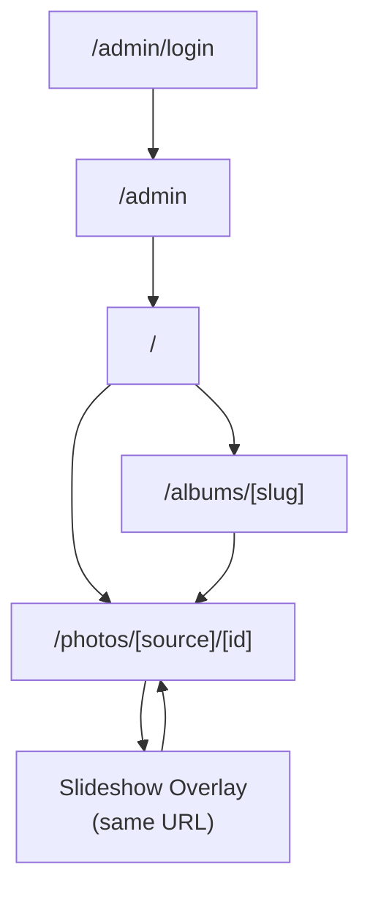

# Workflow

## 文件目的
以流程圖與文字 wireframe 整理網站的主要操作路徑，作為設計、前端、後端、reviewer 的共同地圖。
本版本反映 **Direction C UI 改版**（決策於 2026-03-27）新增的互動行為。

## 角色
- 訪客：瀏覽首頁、相簿、照片頁、留言、按讚、幻燈片
- 管理者：登入後台、上傳照片、管理相簿、查看留言與按讚概況

## 站點地圖
```text
/
├── /albums/[slug]
├── /photos/[source]/[id]
└── /admin/login
    └── /admin
```

---

## 訪客流程

### Flow A：首頁進入單張照片
```text
首頁 /
  -> Hero 全出血照片自動輪播（視覺感知，無需互動）
  -> 點擊 "View Portfolio" 或向下捲動
  -> 進入照片牆（LATEST WORK）
  -> hover 照片卡 -> overlay 顯示標題 / 日期
  -> 點擊照片卡
  -> 進入 /photos/[source]/[id]（暗色主題）
  -> 查看大圖、EXIF（展開）、按讚、留言
  -> 點擊 Header 的 ← → 切換上一張 / 下一張
```

### Flow B：首頁進入相簿再進照片
```text
首頁 /
  -> 點擊 ALBUMS 區塊的相簿卡片（封面 + 名稱）
  -> 進入 /albums/[slug]（淺色主題）
  -> 看封面照 overlay（相簿名稱 / 照片數）
  -> 瀏覽純照片網格
  -> 點擊照片
  -> 進入 /photos/[source]/[id]（暗色主題）
```

### Flow C：照片詳情頁互動
```text
照片頁 /photos/[source]/[id]
  -> 按讚（♡ Like 按鈕，在 Interactions 區塊）
     -> server action 依 visitorId 切換 likes
     -> ♡ N 數字即時更新

  -> 留言（Leave a comment 表單）
     -> server action 寫入 comments
     -> 留言列表即時更新

  -> 展開 EXIF（點 ▸ EXIF 標題）
     -> Collapsible 展開，顯示 f/、快門、ISO、焦段等

  -> 切換照片（Header 的 ← Prev / Next →）
     -> 導航至相鄰照片，維持暗色主題
```

### Flow D：進入幻燈片模式
```text
照片頁底部 -> 點擊 [Slideshow]
  -> 幻燈片 overlay 開啟（全黑）
  -> 底部縮圖帶預設展開
  -> 點擊縮圖 -> 跳至該張（scrollIntoView 自動定位）
  -> 點擊 [⌄] -> 縮圖帶收合，改為 dot indicator
  -> 點擊 [⌃] -> 縮圖帶展開
  -> 點擊 ▶ Play -> 自動輪播（5 秒一張）
  -> 點擊 ❙❙ Pause -> 暫停
  -> 鍵盤 ← → 切換、空白鍵播放/暫停、Esc 關閉
  -> 點擊 ✕ Close -> 關閉幻燈片，回到照片頁
```

### Flow E：Hero 照片輪播（純視覺，無需互動）
```text
首頁載入
  -> HeroSection (client component) 取得 photos 陣列
  -> 每 5 秒自動切換一張照片
  -> CSS opacity crossfade（舊照片淡出，新照片淡入）
  -> 訪客無需操作，純視覺感知
```

---

## 管理者流程

### Flow F：登入後台
```text
/admin/login
  -> 輸入帳密
  -> 建立 session cookie
  -> redirect /admin
```

### Flow G：上傳照片
```text
/admin
  -> 選擇相簿 + 上傳檔案
  -> image pipeline 產出 original / medium / thumbnail
  -> manifest repository 寫入 photos.json
  -> revalidate / 與 /admin
```

### Flow H：管理相簿與互動資料
```text
/admin
  -> 建立相簿（name / slug / desc）
  -> 編輯既有相簿
  -> 查看最新留言 -> 刪除不當留言
  -> 查看按讚統計 -> 清空指定照片 like
```

---

## 主題切換行為（Direction C）

```text
首頁 / → 淺色主題（amber/stone 暖白）
相簿頁 /albums/[slug] → 淺色主題
照片詳情頁 /photos/[source]/[id] → 暗色主題（#0c0c0c）
幻燈片 overlay → 純黑（#000）
後台 → 獨立主題，不受影響
```

主題切換**不透過 JavaScript 動態切換**，而是由 route group layout 分離決定：
- `(browse)` route group → 套用淺色 layout
- `photos/` 路由 → 套用暗色 layout

---

## 頁面關係圖



---

## 頁面責任（含 Direction C 更新）

| 頁面 | 主題 | 主要目的 | 主要互動 |
| --- | --- | --- | --- |
| `/` | 淺色 | 品牌入口與作品瀏覽 | Hero 輪播（被動）、點照片、點相簿 |
| `/albums/[slug]` | 淺色 | 主題式瀏覽 | 點照片、回首頁 |
| `/photos/[source]/[id]` | 暗色 | 單張照片沉浸式體驗 | 留言、按讚、切圖、幻燈片 |
| `/admin/login` | 獨立 | 驗證管理者身份 | 登入 |
| `/admin` | 獨立 | 上傳與管理工作台 | 上傳、建相簿、編輯、審查 |

---

## 協作時怎麼用這份文件
- 討論新功能先確認它落在哪一條 flow
- 若要加頁面，先補站點地圖與流程
- 若只是改 UI 呈現但不改互動，只更新 `mockups.md`
- 若流程改動連到 server action 或資料來源，同步更新 `architecture.md`
- 若新增主題行為，更新「主題切換行為」區段
