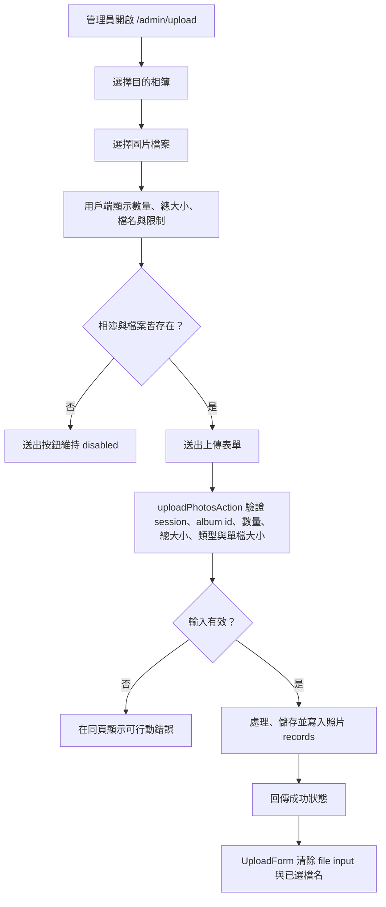
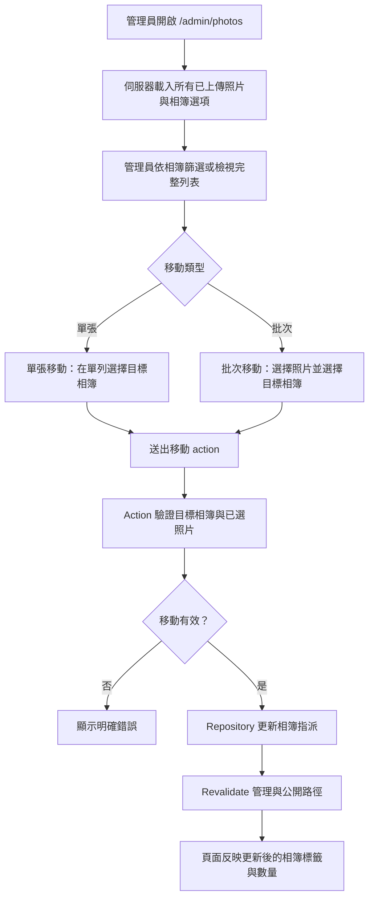

# 管理後台多頁照片管理實作計畫

> **給 agentic workers：** 必要子技能：請使用 superpowers:subagent-driven-development（建議）或 superpowers:executing-plans，逐項任務實作本計畫。步驟使用 checkbox（`- [ ]`）語法追蹤。

**目標：** 依照 2026-04-12 設計建立 v1 管理後台：將 admin 拆成專屬頁面、補齊照片相簿重新指派功能，並修正上傳選取狀態與批次限制回饋。

**架構：** 保留目前 Next.js 16 App Router、Server Actions 與 repository pattern。在既有 admin session guard 後方新增聚焦的 `/admin/*` 頁面，將現有 admin widgets 移入這些頁面，並擴充 `PhotoRepository`，讓 Prisma 與 manifest storage 都能在不同相簿間移動照片，且 page components 不需接觸 storage 細節。

**技術棧：** Next.js 16 App Router、React 19、TypeScript、Server Actions、Prisma + SQLite、manifest fallback repositories、Cloudflare R2、Tailwind CSS 4

---

## 來源文件

- 回饋待辦：`docs/issue-tracker/user-feedback-backlog.md`
- 已核准 v1 設計：`docs/superpowers/specs/2026-04-12-admin-multipage-photo-management-design.md`
- 已被取代的廣版計畫：`docs/superpowers/plans/2026-04-10-admin-feedback-implementation-plan.md`

本計畫僅實作 2026-04-12 v1 範圍：

- 納入：feedback 1、2、3、4。
- 延後：feedback 5 相簿封面輪播、feedback 6 管理員留言回覆。

---

## 架構圖

```mermaid
flowchart TD
  browser[瀏覽器]
  router[Next.js App Router /admin/*]
  layout[src/app/admin/layout.tsx]
  shell[src/components/admin/admin-shell.tsx]

  dashboard[/admin dashboard]
  uploadPage[/admin/upload]
  photosPage[/admin/photos]
  albumsPage[/admin/albums]
  commentsPage[/admin/comments]
  likesPage[/admin/likes]

  uploadForm[UploadForm]
  photoManager[PhotoManager]
  albumForms[AlbumForm + AlbumEditorForm]
  commentsList[CommentModerationList]
  likesList[LikeSummaryList]

  uploadAction[uploadPhotosAction]
  moveOneAction[movePhotoToAlbumAction]
  moveManyAction[movePhotosToAlbumAction]

  auth[requireAdminSession]
  uploadService[uploadPhotos]
  imagePipeline[processUpload]
  storage[getStorageDriver.putObject]
  photoRepo[getPhotoRepository]
  prismaRepo[Prisma photo repository]
  manifestRepo[Manifest photo repository]
  revalidate[revalidate affected paths]

  browser --> router
  router --> layout --> shell
  shell --> dashboard
  shell --> uploadPage
  shell --> photosPage
  shell --> albumsPage
  shell --> commentsPage
  shell --> likesPage

  uploadPage --> uploadForm --> uploadAction
  photosPage --> photoManager
  photoManager --> moveOneAction
  photoManager --> moveManyAction
  albumsPage --> albumForms
  commentsPage --> commentsList
  likesPage --> likesList

  uploadAction --> auth
  uploadAction --> uploadService
  uploadService --> imagePipeline --> storage
  uploadService --> photoRepo

  moveOneAction --> auth
  moveManyAction --> auth
  moveOneAction --> photoRepo
  moveManyAction --> photoRepo
  moveOneAction --> revalidate
  moveManyAction --> revalidate

  photoRepo --> prismaRepo
  photoRepo --> manifestRepo
```

---

## 功能流程

### 上傳流程



### 照片重新指派流程



### 管理導覽流程

```mermaid
flowchart LR
  dashboard[/admin]
  upload[/admin/upload]
  photos[/admin/photos]
  albums[/admin/albums]
  comments[/admin/comments]
  likes[/admin/likes]
  site[/]

  dashboard -->|上傳照片| upload
  dashboard -->|管理照片| photos
  dashboard -->|管理相簿| albums
  dashboard -->|審核留言| comments
  dashboard -->|查看 likes| likes
  dashboard -->|前往網站| site
```

---

## 頁面 Mockups

### `/admin` Dashboard

```text
+------------------------------------------------------------------+
| 管理後台                                      [前往網站] [登出]   |
| 歡迎，<username>                                                  |
+------------------------------------------------------------------+
| [照片 128] [相簿 9] [留言 23] [累計喜歡 18]                      |
+------------------------------------------------------------------+
| 常用工作                                                         |
| [上傳照片] [管理照片] [管理相簿] [審核留言] [查看互動]           |
+------------------------------------------------------------------+
| 最近狀態                                                         |
| - 上傳、留言、相簿摘要                                           |
+------------------------------------------------------------------+
```

### `/admin/upload`

```text
+------------------------------------------------------------------+
| 管理後台 > 上傳照片                         [返回網站] [登出]    |
+------------------------------------------------------------------+
| 上傳照片                                                         |
| 先選擇目的相簿，再選擇圖片。系統會檢查檔案數與總大小。           |
+------------------------------------------------------------------+
| 目的相簿 * [ 請選擇相簿 v ]                                      |
|                                                                  |
| +--------------------------------------------------------------+ |
| | 選擇照片                                                     | |
| | JPG, PNG, WebP, AVIF。單檔 20MB，最多 100 張，總量 200MB。   | |
| +--------------------------------------------------------------+ |
|                                                                  |
| 已選 14 張 / 143.2MB                                             |
| [IMG_1011.jpg] [IMG_1012.jpg] [IMG_1013.jpg] [+11 張]           |
|                                                                  |
| [開始上傳]                                                       |
+------------------------------------------------------------------+
```

### `/admin/photos`

```text
+------------------------------------------------------------------+
| 管理後台 > 管理照片                         [返回網站] [登出]    |
+------------------------------------------------------------------+
| 篩選相簿 [ 全部相簿 v ]                                          |
| 批次移動：已選 3 張，移到 [ 目標相簿 v ] [批次移動]              |
+------------------------------------------------------------------+
| [ ] Thumb | Title      | Current album | Size      | Actions     |
| [ ] img   | IMG 1011   | 生活紀錄      | 3000x2000 | [v] [移動]  |
| [ ] img   | IMG 1012   | 作品集        | 2400x1600 | [v] [移動]  |
+------------------------------------------------------------------+
```

### `/admin/albums`

```text
+------------------------------------------------------------------+
| 管理相簿                                                         |
| [相簿名稱] [相簿描述] [建立相簿]                                 |
+------------------------------------------------------------------+
| 現有相簿                                                         |
| 作品集 42 張 [查看相簿]                                          |
| [名稱 input] [描述 textarea] [更新相簿]                          |
+------------------------------------------------------------------+
```

### `/admin/comments` 與 `/admin/likes`

```text
/admin/comments：在獨立頁面重用 CommentModerationList。
/admin/likes：   在獨立頁面重用 LikeSummaryList。
```

---

## 檔案結構

### 新增

- `src/app/admin/layout.tsx` - shared route boundary。
- `src/app/admin/upload/page.tsx` - 上傳頁。
- `src/app/admin/photos/page.tsx` - 照片管理頁。
- `src/app/admin/albums/page.tsx` - 相簿管理頁。
- `src/app/admin/comments/page.tsx` - 留言 moderation 頁。
- `src/app/admin/likes/page.tsx` - like summary 頁。
- `src/app/admin/photo-actions.ts` - 單張與批次照片移動的 server actions。
- `src/components/admin/admin-shell.tsx` - admin 框架與導覽。
- `src/components/admin/photo-manager.tsx` - 篩選、選取與移動照片的 client UI。
- `src/lib/uploads/upload-limits.ts` - 共享上傳常數與 pure validation。

### 修改

- `src/app/admin/page.tsx` - 從 all-in-one 頁面改為 dashboard。
- `src/components/admin/upload-form.tsx` - 新增受控相簿/檔案狀態與成功後 reset。
- `src/app/admin/upload-actions.ts` - 驗證必要相簿與限制。
- `src/lib/uploads/upload-service.ts` - 重用共享上傳驗證。
- `src/lib/photos/repository.ts` - 新增 Prisma 與 manifest 的 move methods。
- `src/lib/photos/queries.ts` - 新增 admin photo list helper。
- `next.config.ts` - 讓 Server Action body limit 對齊 v1 批次大小。
- `docs/issue-tracker/user-feedback-backlog.md` - 記錄目前 v1 執行計畫。

---

## 共享實作合約

### 上傳限制

建立 `src/lib/uploads/upload-limits.ts`，內容包含：

```ts
export const MAX_UPLOAD_FILES = 100;
export const MAX_UPLOAD_FILE_SIZE_BYTES = 20 * 1024 * 1024;
export const MAX_UPLOAD_TOTAL_SIZE_BYTES = 200 * 1024 * 1024;

export const ALLOWED_UPLOAD_IMAGE_TYPES = new Set([
  "image/jpeg",
  "image/png",
  "image/webp",
  "image/avif",
]);

export type UploadValidationInput = {
  files: File[];
  albumId: number | null;
};

export type UploadValidationResult =
  | { ok: true; files: File[]; albumId: number }
  | { ok: false; error: string };
```

同一檔案必須匯出：

- `formatBytes(bytes: number): string`
- `validateUploadInput(input: UploadValidationInput): UploadValidationResult`

驗證順序：

1. album id 為必填
2. 至少需要一個非空檔案
3. 最大檔案數
4. 最大總 bytes
5. 允許的 MIME type
6. 單檔大小限制

### Photo Repository Contract

擴充 `PhotoRepository`：

```ts
export type PhotoAlbumAssignment = {
  id: number;
  name: string;
  slug: string;
};

export interface PhotoRepository {
  listUploadedPhotos(): Promise<PhotoRecord[]>;
  savePhotos(records: PhotoRecord[]): Promise<void>;
  renameAlbumReferences(albumId: number, name: string, slug: string): Promise<void>;
  movePhotoToAlbum(photoId: number, album: PhotoAlbumAssignment): Promise<void>;
  movePhotosToAlbum(photoIds: number[], album: PhotoAlbumAssignment): Promise<void>;
}
```

Manifest updates 必須寫入 `albumId`、`albumName` 與 `albumSlug`。Prisma updates 只需要 `albumId`，因為 reads 已經會 join album metadata。

---

## 實作任務

### 任務 1：更新回饋待辦以反映目前 v1 範圍

**檔案：**
- 修改：`docs/issue-tracker/user-feedback-backlog.md`
- 新增：`docs/superpowers/plans/2026-04-13-admin-multipage-photo-management-implementation-plan.md`

- [ ] **步驟 1：在頂部 summary 後加入目前執行註記**

在 summary 後插入：

```md
## 目前執行計畫

目前啟用的 v1 實作記錄於：

- `docs/superpowers/specs/2026-04-12-admin-multipage-photo-management-design.md`
- `docs/superpowers/plans/2026-04-13-admin-multipage-photo-management-implementation-plan.md`

本 v1 目標涵蓋 feedback 1-4：

- 大批次上傳的清楚提示與 guardrails
- production-ready 的多頁管理後台結構
- 完整的已上傳照片管理
- 必填上傳目的地與上傳後修正

Feedback 5 相簿封面輪播與 feedback 6 管理員留言回覆保留在 backlog，供後續階段處理。
```

- [ ] **步驟 2：驗證文件連結**

執行：

```powershell
rg -n "Current Execution Plan|2026-04-13-admin-multipage-photo-management|Feedback 5|Feedback 6" docs/issue-tracker/user-feedback-backlog.md
```

預期：新的 plan path 會出現，且 feedback 5/6 仍以 deferred backlog items 形式存在。

- [ ] **步驟 3：Commit**

執行：

```powershell
git add docs/issue-tracker/user-feedback-backlog.md docs/superpowers/plans/2026-04-13-admin-multipage-photo-management-implementation-plan.md
git commit -m "docs: plan admin photo management implementation"
```

---

### 任務 2：建立共享 Admin Shell 與 Dashboard

**檔案：**
- 新增：`src/components/admin/admin-shell.tsx`
- 新增：`src/app/admin/layout.tsx`
- 修改：`src/app/admin/page.tsx`

- [ ] **步驟 1：閱讀相關 Next.js docs**

執行：

```powershell
Get-Content -Path node_modules/next/dist/docs/01-app/01-getting-started/03-layouts-and-pages.md
```

預期：確認 nested layouts 會包住 child pages，且不需要 root `html` / `body`。

- [ ] **步驟 2：建立 `AdminShell`**

建立 `src/components/admin/admin-shell.tsx`：

```tsx
import Link from "next/link";

import { logoutAction } from "@/app/admin/login/actions";
import { Button } from "@/components/ui/button";

const navItems = [
  { href: "/admin", label: "總覽" },
  { href: "/admin/upload", label: "上傳照片" },
  { href: "/admin/photos", label: "管理照片" },
  { href: "/admin/albums", label: "管理相簿" },
  { href: "/admin/comments", label: "審核留言" },
  { href: "/admin/likes", label: "查看互動" },
];

type AdminShellProps = {
  children: React.ReactNode;
  username?: string;
};

export function AdminShell({ children, username }: AdminShellProps) {
  return (
    <main className="mx-auto flex min-h-screen w-full max-w-6xl flex-col px-5 py-8 sm:px-8 lg:px-12">
      <header className="flex flex-col gap-5 border-b border-line pb-6 lg:flex-row lg:items-center lg:justify-between">
        <div>
          <p className="text-sm tracking-[0.2em] text-stone-500 uppercase">管理後台</p>
          <h1 className="mt-2 text-3xl font-semibold text-stone-900">
            {username ? `歡迎，${username}` : "管理中心"}
          </h1>
        </div>
        <div className="flex flex-wrap items-center gap-3">
          <Link href="/" className="text-sm text-stone-700 underline-offset-4 hover:underline">
            前往網站
          </Link>
          <form action={logoutAction}>
            <Button variant="secondary" type="submit">登出</Button>
          </form>
        </div>
      </header>
      <nav className="mt-5 flex flex-wrap gap-2" aria-label="Admin navigation">
        {navItems.map((item) => (
          <Link
            key={item.href}
            href={item.href}
            className="rounded-lg border border-line bg-white px-3 py-2 text-sm text-stone-700 transition hover:border-stone-400 hover:text-stone-950"
          >
            {item.label}
          </Link>
        ))}
      </nav>
      <div className="mt-8">{children}</div>
    </main>
  );
}
```

- [ ] **步驟 3：新增最小 admin layout**

建立 `src/app/admin/layout.tsx`：

```tsx
export default function AdminLayout({ children }: { children: React.ReactNode }) {
  return children;
}
```

- [ ] **步驟 4：將 `/admin` 改為 dashboard**

修改 `src/app/admin/page.tsx`，使其：

- 呼叫 `requireAdminSession()`
- 取得 uploaded photos、albums、admin comments 與 like summaries
- 渲染 dashboard stats 與 workflow links
- 不渲染 `UploadForm`、`AlbumForm`、`AlbumEditorForm`、`CommentModerationList` 或 `LikeSummaryList`

使用 `getPhotoRepository().listUploadedPhotos()`、`getAlbums()`、`getAdminComments()` 與 `getAdminLikeSummaries()`。

- [ ] **步驟 5：驗證**

執行：

```powershell
npm run build
```

預期：Build 成功，且 `/admin` 不再 import 舊的 all-in-one widgets。

- [ ] **步驟 6：Commit**

執行：

```powershell
git add src/components/admin/admin-shell.tsx src/app/admin/layout.tsx src/app/admin/page.tsx
git commit -m "feat: add admin dashboard shell"
```

---

### 任務 3：將既有 Admin Workflows 移到專屬頁面

**檔案：**
- 新增：`src/app/admin/upload/page.tsx`
- 新增：`src/app/admin/albums/page.tsx`
- 新增：`src/app/admin/comments/page.tsx`
- 新增：`src/app/admin/likes/page.tsx`

- [ ] **步驟 1：建立 upload page**

建立 `/admin/upload`，包含 `AdminShell`、`Panel`、`UploadForm`、`getAlbumOptions()` 與 `requireAdminSession()`。

必要頁面標題：`上傳照片`

必要輔助文案：`先選擇目的相簿，再選擇圖片。系統會檢查檔案數、格式與大小限制。`

- [ ] **步驟 2：建立 albums page**

建立 `/admin/albums`，包含 `AdminShell`、`AlbumForm`、`AlbumEditorForm`、`getAlbums()` 與公開相簿連結。

保留：

- 建立相簿
- 更新相簿名稱
- 更新相簿描述
- 顯示相簿照片數

- [ ] **步驟 3：建立 comments page**

建立 `/admin/comments`，包含 `AdminShell`、`CommentModerationList`、`getAdminComments()` 與 `requireAdminSession()`。

保留刪除留言行為。

- [ ] **步驟 4：建立 likes page**

建立 `/admin/likes`，包含 `AdminShell`、`LikeSummaryList`、`getAdminLikeSummaries()` 與 `requireAdminSession()`。

保留清除 likes 行為。

- [ ] **步驟 5：驗證**

執行：

```powershell
npm run build
```

預期：Build 成功，且新的 `/admin/*` routes 出現在 build output。

- [ ] **步驟 6：Commit**

執行：

```powershell
git add src/app/admin/upload/page.tsx src/app/admin/albums/page.tsx src/app/admin/comments/page.tsx src/app/admin/likes/page.tsx
git commit -m "feat: split admin workflows into pages"
```

---

### 任務 4：新增上傳限制與成功後 Reset

**檔案：**
- 新增：`src/lib/uploads/upload-limits.ts`
- 修改：`src/components/admin/upload-form.tsx`
- 修改：`src/app/admin/upload-actions.ts`
- 修改：`src/lib/uploads/upload-service.ts`
- 修改：`next.config.ts`

- [ ] **步驟 1：建立 upload limits helper**

建立 `src/lib/uploads/upload-limits.ts`，內容包含上方列出的 constants 與 validation contract。

必要錯誤訊息：

- missing album：`請先選擇要上傳到的相簿。`
- no files：`請至少選擇一張圖片。`
- too many files：`一次最多只能上傳 100 張圖片。`
- unsupported type 必須包含檔名與可接受格式
- oversized file 必須包含檔名與 `20MB`
- oversized batch 必須包含實際總量與 `200MB`

- [ ] **步驟 2：更新 upload service**

修改 `src/lib/uploads/upload-service.ts`：

- 移除 local upload constants
- import `validateUploadInput`
- 在 album lookup 與 `processUpload` 前呼叫它
- 拒絕缺少或不存在的相簿
- 保留既有 storage 與 image processing loop

必要結構：

```ts
const validation = validateUploadInput({
  files,
  albumId: albumId ?? null,
});

if (!validation.ok) {
  throw new Error(validation.error);
}

const album =
  (await getAlbumOptions()).find((item) => item.id === validation.albumId) ?? null;

if (!album) {
  throw new Error("找不到指定的相簿，請重新整理管理後台後再試。");
}

const validFiles = validation.files;
```

- [ ] **步驟 3：更新 upload action**

修改 `src/app/admin/upload-actions.ts`：

- 將 `albumId` parse 成 `number | null`
- 將該值傳給 `uploadPhotos`
- 保留 `requireAdminSession()`
- 保留 `/`、`/admin` 的 revalidation，並新增 `/admin/upload`

- [ ] **步驟 4：更新 upload form**

修改 `src/components/admin/upload-form.tsx`：

- 新增 `useEffect` 與 `useRef`
- 追蹤 selected album id
- 追蹤 selected file metadata，而不只是 names
- 顯示已選數量與總大小
- 在相簿與檔案都存在前 disable submit
- 當 `state.success` 變化時清除 file input 與 selected files

必要 reset：

```tsx
useEffect(() => {
  if (!state.success) {
    return;
  }

  setSelectedFiles([]);
  if (fileInputRef.current) {
    fileInputRef.current.value = "";
  }
}, [state.success]);
```

- [ ] **步驟 5：對齊 Next config**

修改 `next.config.ts`：

```ts
serverActions: {
  bodySizeLimit: "220mb",
},
```

這會在 200MB 產品限制上方留下餘裕，但不假裝目前流程是 resumable uploader。

- [ ] **步驟 6：驗證**

執行：

```powershell
npm run build
```

預期：Build 成功，且 `UploadForm` 沒有 import server-only module。

- [ ] **步驟 7：Commit**

執行：

```powershell
git add src/lib/uploads/upload-limits.ts src/components/admin/upload-form.tsx src/app/admin/upload-actions.ts src/lib/uploads/upload-service.ts next.config.ts
git commit -m "feat: harden admin upload limits"
```

---

### 任務 5：新增 Photo Repository 相簿移動支援

**檔案：**
- 修改：`src/lib/photos/repository.ts`
- 修改：`src/lib/photos/queries.ts`

- [ ] **步驟 1：擴充 repository interface**

依照本計畫中的 contract，在 `src/lib/photos/repository.ts` 新增 `PhotoAlbumAssignment`、`movePhotoToAlbum` 與 `movePhotosToAlbum`。

- [ ] **步驟 2：新增 manifest assignment helper**

新增：

```ts
function assignPhotoAlbum(photo: PhotoRecord, album: PhotoAlbumAssignment): PhotoRecord {
  return {
    ...photo,
    albumId: album.id,
    albumName: album.name,
    albumSlug: album.slug,
  };
}
```

- [ ] **步驟 3：實作 manifest move methods**

加入 `jsonPhotoRepository`：

```ts
async movePhotoToAlbum(photoId, album) {
  const photos = await listManifestPhotos();
  await replaceManifestPhotos(
    photos.map((photo) => (photo.id === photoId ? assignPhotoAlbum(photo, album) : photo)),
  );
},
async movePhotosToAlbum(photoIds, album) {
  const targetIds = new Set(photoIds);
  const photos = await listManifestPhotos();
  await replaceManifestPhotos(
    photos.map((photo) => (targetIds.has(photo.id) ? assignPhotoAlbum(photo, album) : photo)),
  );
},
```

- [ ] **步驟 4：實作 Prisma move methods**

加入 `prismaPhotoRepository`：

```ts
async movePhotoToAlbum(photoId, album) {
  await prisma.photo.update({
    where: { id: toPrismaBigInt(photoId) },
    data: { albumId: toPrismaBigInt(album.id) },
  });
},
async movePhotosToAlbum(photoIds, album) {
  await prisma.photo.updateMany({
    where: {
      id: {
        in: photoIds.map((photoId) => toPrismaBigInt(photoId)),
      },
    },
    data: { albumId: toPrismaBigInt(album.id) },
  });
},
```

- [ ] **步驟 5：新增 admin photo query helper**

修改 `src/lib/photos/queries.ts`：

```ts
export async function getAdminUploadedPhotos(): Promise<GalleryPhoto[]> {
  return getPhotoRepository().listUploadedPhotos();
}
```

- [ ] **步驟 6：驗證**

執行：

```powershell
npm run build
```

預期：TypeScript 接受更新後的 repository contract，且既有 repository users 仍可編譯。

- [ ] **步驟 7：Commit**

執行：

```powershell
git add src/lib/photos/repository.ts src/lib/photos/queries.ts
git commit -m "feat: support moving photos between albums"
```

---

### 任務 6：新增照片移動 Server Actions

**檔案：**
- 新增：`src/app/admin/photo-actions.ts`

- [ ] **步驟 1：建立 action file 與 parsing helpers**

建立 `src/app/admin/photo-actions.ts`：

```ts
"use server";

import { revalidatePath } from "next/cache";

import { getAlbumRepository } from "@/lib/albums/repository";
import { requireAdminSession } from "@/lib/auth/session";
import { getPhotoRepository } from "@/lib/photos/repository";

export type PhotoMoveFormState = {
  error?: string;
  success?: string;
};

function parseNumber(value: FormDataEntryValue | null) {
  const parsed = Number(String(value || "").trim());
  return Number.isFinite(parsed) && parsed > 0 ? parsed : null;
}

function parsePhotoIds(formData: FormData) {
  return formData
    .getAll("photoIds")
    .map((value) => Number(String(value).trim()))
    .filter((value) => Number.isFinite(value) && value > 0);
}

async function getTargetAlbum(albumId: number) {
  const albums = await getAlbumRepository().listAlbums();
  return albums.find((album) => album.id === albumId) ?? null;
}

function revalidatePhotoMovePaths(photoIds: number[], albumSlug: string) {
  revalidatePath("/");
  revalidatePath("/admin");
  revalidatePath("/admin/photos");
  revalidatePath("/admin/albums");
  revalidatePath(`/albums/${albumSlug}`);

  for (const photoId of photoIds) {
    revalidatePath(`/photos/uploaded/${photoId}`);
  }
}
```

- [ ] **步驟 2：新增單張移動 action**

新增：

```ts
export async function movePhotoToAlbumAction(
  photoId: number,
  _prevState: PhotoMoveFormState,
  formData: FormData,
): Promise<PhotoMoveFormState> {
  await requireAdminSession();

  const albumId = parseNumber(formData.get("albumId"));
  if (!albumId) {
    return { error: "請選擇要移動到的目標相簿。" };
  }

  const album = await getTargetAlbum(albumId);
  if (!album) {
    return { error: "找不到指定的相簿，請重新整理管理後台後再試。" };
  }

  await getPhotoRepository().movePhotoToAlbum(photoId, {
    id: album.id,
    name: album.name,
    slug: album.slug,
  });

  revalidatePhotoMovePaths([photoId], album.slug);

  return { success: `已移動到「${album.name}」。` };
}
```

- [ ] **步驟 3：新增批次移動 action**

新增：

```ts
export async function movePhotosToAlbumAction(
  _prevState: PhotoMoveFormState,
  formData: FormData,
): Promise<PhotoMoveFormState> {
  await requireAdminSession();

  const photoIds = parsePhotoIds(formData);
  if (photoIds.length === 0) {
    return { error: "請先選擇要移動的照片。" };
  }

  const albumId = parseNumber(formData.get("albumId"));
  if (!albumId) {
    return { error: "請選擇要移動到的目標相簿。" };
  }

  const album = await getTargetAlbum(albumId);
  if (!album) {
    return { error: "找不到指定的相簿，請重新整理管理後台後再試。" };
  }

  await getPhotoRepository().movePhotosToAlbum(photoIds, {
    id: album.id,
    name: album.name,
    slug: album.slug,
  });

  revalidatePhotoMovePaths(photoIds, album.slug);

  return { success: `已將 ${photoIds.length} 張照片移動到「${album.name}」。` };
}
```

- [ ] **步驟 4：驗證**

執行：

```powershell
npm run build
```

預期：Server Action file 可編譯，且只 import server-safe modules。

- [ ] **步驟 5：Commit**

執行：

```powershell
git add src/app/admin/photo-actions.ts
git commit -m "feat: add photo album move actions"
```

---

### 任務 7：建立照片管理頁

**檔案：**
- 新增：`src/components/admin/photo-manager.tsx`
- 新增：`src/app/admin/photos/page.tsx`

- [ ] **步驟 1：建立 `PhotoManager` client component**

建立 `src/components/admin/photo-manager.tsx`，包含：

- `"use client"`
- props：`photos: GalleryPhoto[]`、`albums: Array<{ id: number; name: string }>`
- 相簿篩選 state：`"all" | "unassigned" | album id string`
- selected photo ids state
- 使用 `movePhotosToAlbumAction` 的 bulk form
- 使用 `movePhotoToAlbumAction.bind(null, photo.id)` 的 row form
- thumbnail、title、current album、dimensions、public photo link、單張移動 controls

必要 UI 行為：

- filter 為 `all` 時顯示所有照片。
- filter 為 `unassigned` 時顯示 `albumId == null` 的照片。
- 未選擇照片時 disable bulk move。
- 顯示單張與批次 actions 的 success/error messages。

- [ ] **步驟 2：建立 photos page**

建立 `src/app/admin/photos/page.tsx`：

```tsx
import { AdminShell } from "@/components/admin/admin-shell";
import { PhotoManager } from "@/components/admin/photo-manager";
import { Panel } from "@/components/ui/panel";
import { getAlbumOptions } from "@/lib/albums/queries";
import { requireAdminSession } from "@/lib/auth/session";
import { getAdminUploadedPhotos } from "@/lib/photos/queries";

export default async function AdminPhotosPage() {
  const session = await requireAdminSession();
  const [photos, albums] = await Promise.all([
    getAdminUploadedPhotos(),
    getAlbumOptions(),
  ]);

  return (
    <AdminShell username={session.username}>
      <Panel>
        <h2 className="text-2xl font-semibold text-stone-900">管理照片</h2>
        <p className="mt-3 leading-7 text-stone-700">
          檢查已上傳照片，修正相簿歸屬，並在不重新上傳的情況下移動照片。
        </p>
        <div className="mt-6">
          <PhotoManager photos={photos} albums={albums} />
        </div>
      </Panel>
    </AdminShell>
  );
}
```

- [ ] **步驟 3：驗證**

執行：

```powershell
npm run build
```

預期：Build 成功，且 `/admin/photos` 可編譯。

- [ ] **步驟 4：Commit**

執行：

```powershell
git add src/components/admin/photo-manager.tsx src/app/admin/photos/page.tsx
git commit -m "feat: add admin photo management page"
```

---

### 任務 8：最終驗證與驗收

**檔案：**
- 預期不需要 code changes，除非驗證發現問題。

- [ ] **步驟 1：執行 build**

執行：

```powershell
npm run build
```

預期：exit code 0。

- [ ] **步驟 2：執行 session verification**

執行：

```powershell
.session/verify.ps1
```

預期：script 成功完成。

- [ ] **步驟 3：手動檢查 routes**

檢查：

- `/admin` 只顯示 dashboard stats 與 workflow links。
- `/admin/upload` 顯示上傳表單。
- `/admin/photos` 列出所有已上傳照片。
- `/admin/albums` 保留相簿建立/編輯。
- `/admin/comments` 保留刪除流程。
- `/admin/likes` 保留 like summary 與 clear flow。

- [ ] **步驟 4：手動檢查上傳**

檢查：

- 選擇相簿與小型有效批次。
- 已選檔名與總大小會出現。
- 送出成功。
- 成功訊息出現。
- 已選檔名消失。
- file input 沒有已選檔案。
- 缺少相簿、檔案過多、總大小超限、單檔超限與不支援格式都會顯示可行動錯誤。

- [ ] **步驟 5：手動檢查照片移動**

檢查：

- 將單張照片移到另一個相簿。
- 將多張已選照片移到另一個相簿。
- `/admin/photos` 反映新的相簿標籤。
- `/admin/albums` 數量更新。
- 舊公開相簿不再包含移動後的照片。
- 新公開相簿包含移動後的照片。
- 照片詳情頁仍可載入。

- [ ] **步驟 6：若需要，commit 驗證修正**

若驗證需要修正：

```powershell
git add <changed-files>
git commit -m "fix: polish admin photo management flow"
```

若沒有檔案變更，不要建立 empty commit。

---

## Spec Coverage Review

- 多頁管理後台：任務 2 與 3。
- Dashboard 作為 hub：任務 2。
- 上傳頁：任務 3 與 4。
- 上傳成功後清除已選檔案：任務 4 與 8。
- 上傳限制與訊息：任務 4 與 8。
- 完整 `/admin/photos` 頁：任務 5、6、7 與 8。
- 單張照片移動：任務 5、6、7 與 8。
- 批次照片移動：任務 5、6、7 與 8。
- 保留相簿編輯：任務 3 與 8。
- 保留 comments 與 likes：任務 3 與 8。
- 明確延後 feedback 5 與 6：任務 1。

沒有刻意遺漏任何 2026-04-12 v1 acceptance criterion。

---

## 執行注意事項

- 本計畫不實作 direct-to-R2 uploads。
- 本計畫不實作 resumable/chunked upload。
- 本計畫不實作留言回覆。
- 本計畫不實作相簿封面輪播。
- 每個 Server Action 都要保留既有 server-side admin authorization checks。
- 保持 Prisma 與 manifest backends 的 repository parity。
- 使用 `apply_patch` 進行 edits。
- 修改 Next.js routing/config 行為前，先閱讀 `node_modules/next/dist/docs/`。
