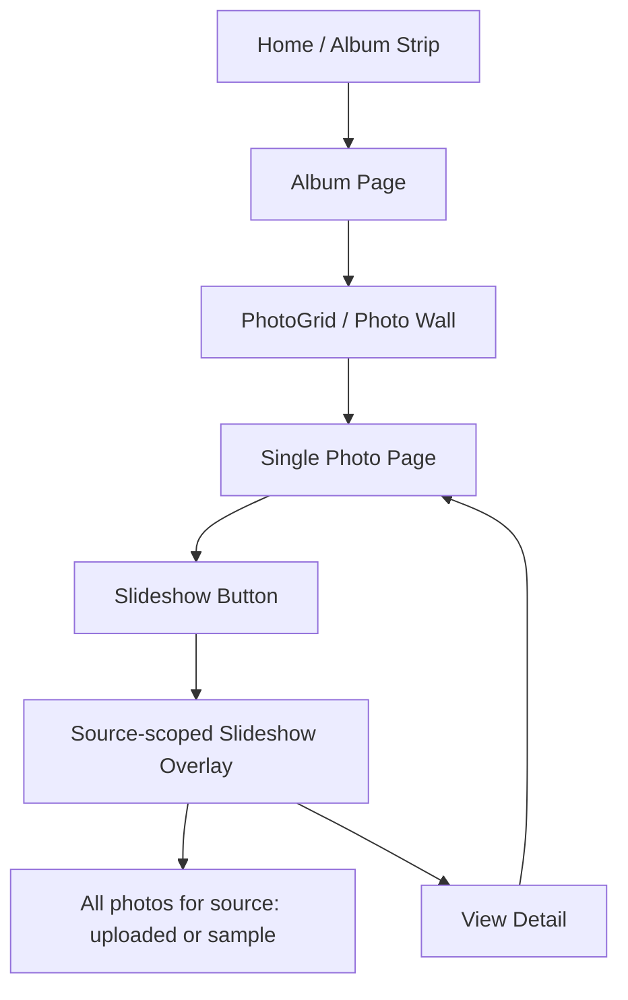
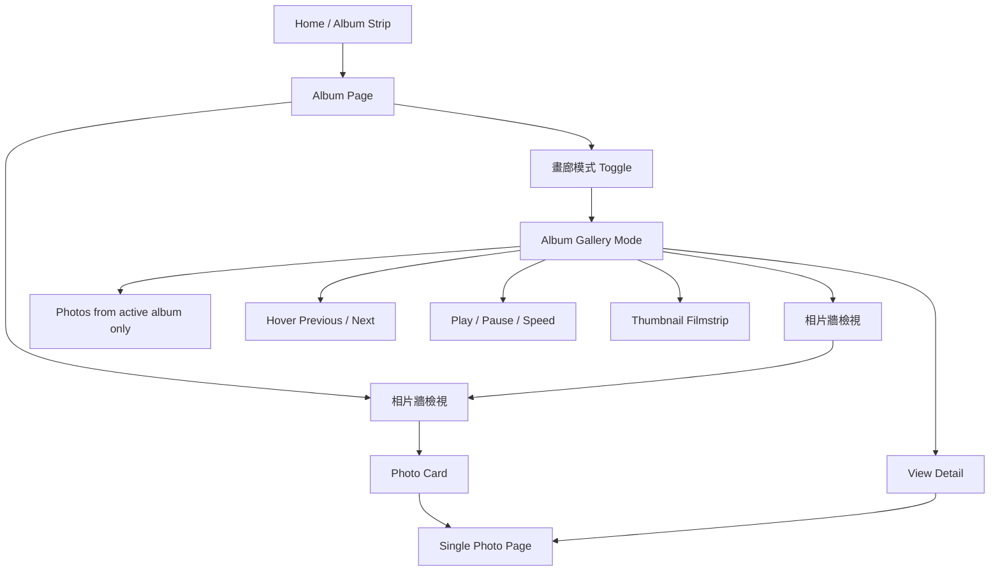
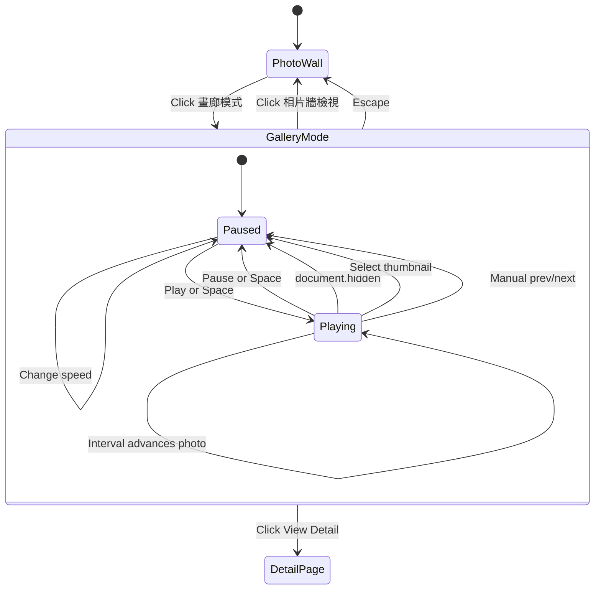
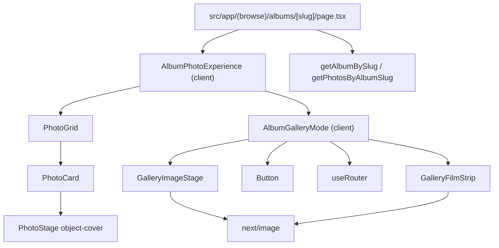

# Album Gallery Mode Phase 1 Implementation Plan

> **For agentic workers:** REQUIRED SUB-SKILL: Use superpowers:subagent-driven-development (recommended) or superpowers:executing-plans to implement this plan task-by-task. Steps use checkbox (`- [ ]`) syntax for tracking.

**Goal:** Move slideshow from the single-photo page into album pages as an album-scoped "Photo Wall / Gallery Mode" experience.

**Architecture:** Keep album data loading in the existing server route, then pass the album photos to a focused client component that owns view mode, current photo, playback state, controls visibility, and playback interval. Preserve `PhotoGrid` for Photo Wall, add a gallery-specific image stage that uses `object-contain`, and use thumbnail URLs for the filmstrip. Remove the slideshow entry from the single-photo page.

**Tech Stack:** Next.js 16 App Router, React 19 client components, `next/image`, Tailwind CSS, existing `GalleryPhoto` data model, existing `framer-motion`.

---

## Context Notes

- Follow `AGENTS.md`: before implementation, read the relevant Next.js docs in `node_modules/next/dist/docs/`.
- Relevant docs already identified for this work:
  - `node_modules/next/dist/docs/01-app/01-getting-started/05-server-and-client-components.md`
  - `node_modules/next/dist/docs/01-app/01-getting-started/12-images.md`
  - `node_modules/next/dist/docs/01-app/01-getting-started/04-linking-and-navigating.md`
- Current album route: `src/app/(browse)/albums/[slug]/page.tsx`
- Current single-photo slideshow entry: `src/app/photos/[source]/[id]/page.tsx`
- Existing viewer pieces: `src/components/gallery/slideshow-viewer.tsx`, `src/components/gallery/film-strip.tsx`, `src/components/gallery/photo-stage.tsx`
- Design addendum: `docs/superpowers/specs/2026-04-15-album-gallery-mode-phase-1-design.md`
- Phase 1 deliberately does not add URL query state. It keeps mode state client-side to finish the main UX first.

## File Structure

- Modify `src/app/(browse)/albums/[slug]/page.tsx`: render the new album experience instead of raw `PhotoGrid`.
- Modify `src/app/photos/[source]/[id]/page.tsx`: remove `SlideshowViewer` import and button from the single-photo page.
- Create `src/components/gallery/album-photo-experience.tsx`: client component for Photo Wall / Gallery Mode switching.
- Create `src/components/gallery/album-gallery-mode.tsx`: client gallery viewer for one album.
- Create `src/components/gallery/gallery-image-stage.tsx`: gallery-specific image renderer using `object-contain`.
- Create `src/components/gallery/gallery-film-strip.tsx`: thumbnail-based filmstrip using `thumbnailUrl`.
- Optionally delete `src/components/gallery/slideshow-viewer.tsx` and `src/components/gallery/film-strip.tsx` only after confirming no imports remain.

---

## Plan Self-Review

### Findings

[BLOCKER] The implementation must not reuse the current single-photo `SlideshowViewer` workflow as-is. That component is source-scoped, title/date-visible, and detail-page-centered. Phase 1 needs an album-scoped client experience mounted from the album page.

[BLOCKER] Gallery image rendering must not use the existing `PhotoStage` default image behavior. `PhotoStage` uses `object-cover`, which is correct for the Photo Wall but causes unacceptable cropping in Gallery Mode. The plan keeps a separate `GalleryImageStage` with `object-contain`.

[WARNING] Keyboard handlers in `AlbumGalleryMode` should be implemented with stable callbacks or inline state updates so React hook dependencies stay correct. If the worker copies the plan snippets literally and ESLint flags missing dependencies, fix the implementation by wrapping navigation handlers in `useCallback` or moving the state updates into the effect.

[WARNING] Hover-only previous/next controls are acceptable for Phase 1 desktop behavior, but mobile tap/swipe is deferred. The implementation must keep keyboard controls and visible filmstrip navigation so the gallery is still usable without hover.

[WARNING] `localStorage` playback preference must only be read in a client component state initializer. Do not move this logic into the server album route.

[NIT] The visible labels should be consistent with the product vocabulary: `相片牆檢視`, `畫廊模式`, and `View Detail` unless the whole UI is localized in a later i18n pass.

### Coverage Check

- Album-only scope: covered by Task 1 and Task 4 because the gallery receives `photos` from `getPhotosByAlbumSlug(slug)`.
- Entry point moved to album page: covered by Task 1 and Task 5.
- Single-photo page slideshow removal: covered by Task 5.
- Previous/next controls on hover: covered by Task 4.
- No photo title in Gallery Mode: covered by Task 4 and Task 6 manual QA.
- Uncropped vertical/horizontal images: covered by Task 2 and Task 6 manual QA.
- Adjustable autoplay cadence: covered by Task 4 and Task 6.
- Playback safety settings: covered by hidden-tab pause, manual-selection pause, reduced-motion handling, and interval persistence.
- Design documentation: added below in Feature Workflow, Data Flow, and Module Architecture sections.

---

## Implementation Guardrails

These notes are required reading before executing the tasks. They capture the review caveats and future-feature boundaries that should shape implementation decisions.

### Product Boundaries

- Phase 1 is about album-scoped Gallery Mode only. Do not add global/source/recent slideshow scopes.
- Keep Gallery Mode as an album-page view switch, not a single-photo-page overlay.
- Keep Photo Wall and Gallery Mode visually and technically separate:
  - Photo Wall can crop via `object-cover` because masonry cards need stable composition.
  - Gallery Mode must not crop; it uses `object-contain`.
- Do not display photo title/date in Gallery Mode. Metadata belongs behind `View Detail`.
- `相片牆檢視`, `畫廊模式`, and `View Detail` are the accepted labels for Phase 1.

### React / Next.js Notes

- Keep `src/app/(browse)/albums/[slug]/page.tsx` as a Server Component. It fetches album data and passes serializable props down.
- Keep browser state in client components only: `AlbumPhotoExperience`, `AlbumGalleryMode`, and `GalleryFilmStrip`.
- Do not read `window`, `document`, or `localStorage` in server files.
- If keyboard handlers reference navigation helpers, use `useCallback` or inline state updates so hook dependencies are complete and `npm run build` does not fail on lint.
- If `prefers-reduced-motion: reduce` is active, do not autoplay and avoid unnecessary transition effects.
- Pause playback on `document.hidden`, manual previous/next, thumbnail selection, and `View Detail`.

### Image Loading / Display Notes

- The gallery main image uses `mediumUrl` with `object-contain`.
- Filmstrip thumbnails must use `thumbnailUrl`, not `mediumUrl`.
- Do not modify `PhotoStage` to satisfy Gallery Mode. Existing cards and detail views rely on it.
- Keep `next/image` sizing explicit:
  - Gallery main image: `fill`, `sizes="100vw"`.
  - Filmstrip thumbnail: `fill`, `sizes="72px"`.

### Direct Download Protection Boundary

- Phase 1 does not implement download prevention. Treat it as a separate backlog feature.
- Do not claim the gallery can fully prevent downloads. Browser-displayed images can always be captured through screenshots, devtools, cache, or network inspection.
- A future protection feature should be framed as friction and access control, not absolute DRM:
  - disable obvious right-click / drag / native image context affordances where appropriate
  - avoid exposing original-resolution URLs publicly
  - serve only watermarked or medium-resolution public images
  - consider signed/expiring URLs or proxy routes if R2 public URLs need tighter control
  - add clear admin settings for public image size and watermark policy

### Analytics Boundary

- Phase 1 does not implement traffic or view-count analytics. Treat it as a separate backlog feature.
- Do not mix analytics writes into Gallery Mode state unless that feature is explicitly being implemented.
- A future analytics feature should define event semantics before code:
  - `album_view`: album page loaded
  - `gallery_open`: switched into Gallery Mode
  - `photo_detail_view`: detail page viewed
  - `photo_impression`: a photo was actively shown for a minimum duration
  - `unique_visitor`: privacy-safe visitor/session estimate
- Admin reporting should distinguish total views, unique visitors, album views, gallery opens, and photo detail views.

---

## Feature Workflow Changes

### Before Phase 1



Current behavior makes the slideshow a single-photo-page action. It also loads photos by `source`, so an uploaded photo can enter a slideshow containing every uploaded photo rather than only the active album.

### After Phase 1



The album page becomes the owner of album browsing. The single-photo page becomes an information/detail page again: image, previous/next detail navigation, likes, comments, and EXIF.

### Gallery Mode State Workflow



Playback is intentionally conservative: user-driven navigation stops playback, and hidden tabs stop playback. This avoids surprising jumps while a user is inspecting or selecting a photo.

---

## Data Flow Design

```mermaid
flowchart LR
  Params[Route params.slug] --> AlbumPage[albums/[slug]/page.tsx Server Component]
  AlbumPage --> GetAlbum[getAlbumBySlug]
  AlbumPage --> GetPhotos[getPhotosByAlbumSlug]
  GetAlbum --> AlbumData[AlbumSummary]
  GetPhotos --> PhotoRecords[GalleryPhoto[] for album]
  AlbumData --> AlbumHeader[Album title / description / count]
  PhotoRecords --> AlbumExperience[AlbumPhotoExperience Client Component]
  AlbumExperience --> PhotoGrid[PhotoGrid]
  AlbumExperience --> GalleryMode[AlbumGalleryMode]
  GalleryMode --> GalleryStage[GalleryImageStage uses mediumUrl]
  GalleryMode --> GalleryFilmStrip[GalleryFilmStrip uses thumbnailUrl]
  GalleryMode --> RouterPush[router.push /photos/source/id]
```

Data ownership stays simple:

- The server album page fetches album metadata and the album-scoped `GalleryPhoto[]`.
- `AlbumPhotoExperience` receives already-filtered album photos. It does not query data.
- `AlbumGalleryMode` receives the same album photos and manages only UI state.
- `GalleryImageStage` reads `mediumUrl` for the main image and uses `object-contain`.
- `GalleryFilmStrip` reads `thumbnailUrl` for 72px thumbnails.
- `View Detail` uses client navigation to the existing single-photo route.

### Removed Data Flow

```mermaid
flowchart TD
  DetailPage[photos/[source]/[id]/page.tsx] --> GetPhotosForSource[getPhotosForSource]
  GetPhotosForSource --> AllSourcePhotos[All source photos]
  AllSourcePhotos --> SlideshowViewer[SlideshowViewer]
```

Phase 1 removes this path from the detail page. Detail pages should no longer fetch slideshow photos, reducing duplicate full-list queries on photo detail navigation.

---

## Module Architecture



Responsibility boundaries:

- `AlbumPhotoExperience`: owns view mode only.
- `AlbumGalleryMode`: owns gallery interaction state only.
- `GalleryImageStage`: owns uncropped main-image rendering only.
- `GalleryFilmStrip`: owns thumbnail navigation only.
- `PhotoGrid`, `PhotoCard`, and `PhotoStage`: remain Photo Wall components and should not be changed to satisfy Gallery Mode.

This split prevents Gallery Mode requirements from breaking the existing Photo Wall. In particular, `object-cover` and `object-contain` are intentionally separated by component.

---

### Task 1: Establish Album Page View Switcher

**Files:**
- Create: `src/components/gallery/album-photo-experience.tsx`
- Modify: `src/app/(browse)/albums/[slug]/page.tsx`

- [ ] **Step 1: Read local Next docs**

Run:

```powershell
Get-Content 'node_modules/next/dist/docs/01-app/01-getting-started/05-server-and-client-components.md' -TotalCount 120
Get-Content 'node_modules/next/dist/docs/01-app/01-getting-started/12-images.md' -TotalCount 140
```

Expected: confirms pages are Server Components by default, interactive state belongs in a `"use client"` boundary, and `next/image` supports remote optimized images.

- [ ] **Step 2: Create the client shell with the current photo wall as both modes**

Create `src/components/gallery/album-photo-experience.tsx`:

```tsx
"use client";

import { useState } from "react";

import { PhotoGrid } from "@/components/gallery/photo-grid";
import { Button } from "@/components/ui/button";
import type { GalleryPhoto } from "@/types/photo";

type AlbumPhotoExperienceProps = {
  albumName: string;
  photos: GalleryPhoto[];
};

type AlbumViewMode = "wall" | "gallery";

export function AlbumPhotoExperience({
  albumName,
  photos,
}: AlbumPhotoExperienceProps) {
  const [mode, setMode] = useState<AlbumViewMode>("wall");

  if (photos.length === 0) {
    return null;
  }

  if (mode === "gallery") {
    return (
      <section className="mt-8">
        <div className="mb-4 flex flex-wrap items-center justify-between gap-3">
          <p className="text-sm text-stone-500">
            Gallery Mode · {albumName}
          </p>
          <Button variant="secondary" onClick={() => setMode("wall")}>
            相片牆檢視
          </Button>
        </div>
        <PhotoGrid photos={photos} />
      </section>
    );
  }

  return (
    <section className="mt-8">
      <div className="mb-5 flex flex-wrap items-center justify-between gap-3">
        <p className="text-sm text-stone-500">相片牆檢視</p>
        <Button variant="secondary" onClick={() => setMode("gallery")}>
          畫廊模式
        </Button>
      </div>
      <PhotoGrid photos={photos} />
    </section>
  );
}
```

- [ ] **Step 3: Wire album page to the new client shell**

Modify `src/app/(browse)/albums/[slug]/page.tsx` imports:

```tsx
import Link from "next/link";
import { notFound } from "next/navigation";

import { AlbumPhotoExperience } from "@/components/gallery/album-photo-experience";
import { Panel } from "@/components/ui/panel";
import { getAlbumBySlug } from "@/lib/albums/queries";
import { getPhotosByAlbumSlug } from "@/lib/photos/queries";
```

Replace the non-empty photo section:

```tsx
      {photos.length > 0 ? (
        <AlbumPhotoExperience albumName={album.name} photos={photos} />
      ) : (
        <section className="mt-8">
          <Panel>
            <p className="leading-7 text-stone-700">
              No photos in this album yet.
            </p>
          </Panel>
        </section>
      )}
```

- [ ] **Step 4: Verify build**

Run:

```powershell
npm run build
```

Expected: build passes and the album page still renders the current photo wall with a visible `畫廊模式` switch.

- [ ] **Step 5: Commit**

```powershell
git add src/app/(browse)/albums/[slug]/page.tsx src/components/gallery/album-photo-experience.tsx
git commit -m "feat: add album photo view switcher"
```

---

### Task 2: Add Gallery Image Stage With No Cropping

**Files:**
- Create: `src/components/gallery/gallery-image-stage.tsx`

- [ ] **Step 1: Create gallery-specific image renderer**

Create `src/components/gallery/gallery-image-stage.tsx`:

```tsx
import Image from "next/image";

import type { GalleryPhoto } from "@/types/photo";

type GalleryImageStageProps = {
  photo: GalleryPhoto;
  priority?: boolean;
};

export function GalleryImageStage({
  photo,
  priority = false,
}: GalleryImageStageProps) {
  const isSample = photo.source === "sample";

  return (
    <div className="relative h-full w-full">
      {isSample ? (
        <div className="flex h-full w-full items-center justify-center bg-stone-950">
          <div className="h-[80%] w-[80%] rounded-lg bg-gradient-to-br from-stone-800 via-stone-600 to-stone-300" />
        </div>
      ) : (
        <Image
          src={photo.mediumUrl}
          alt={photo.title}
          fill
          priority={priority}
          className="object-contain"
          sizes="100vw"
          placeholder={photo.blurDataUrl ? "blur" : "empty"}
          blurDataURL={photo.blurDataUrl}
        />
      )}
    </div>
  );
}
```

- [ ] **Step 2: Verify build**

Run:

```powershell
npm run build
```

Expected: build passes. No UI behavior changes yet.

- [ ] **Step 3: Commit**

```powershell
git add src/components/gallery/gallery-image-stage.tsx
git commit -m "feat: add uncropped gallery image stage"
```

---

### Task 3: Add Thumbnail-Based Gallery Filmstrip

**Files:**
- Create: `src/components/gallery/gallery-film-strip.tsx`

- [ ] **Step 1: Create thumbnail filmstrip**

Create `src/components/gallery/gallery-film-strip.tsx`:

```tsx
"use client";

import Image from "next/image";
import { useEffect, useRef, useState } from "react";

import { cn } from "@/lib/utils";
import type { GalleryPhoto } from "@/types/photo";

type GalleryFilmStripProps = {
  photos: GalleryPhoto[];
  currentIndex: number;
  onSelect: (index: number) => void;
};

export function GalleryFilmStrip({
  photos,
  currentIndex,
  onSelect,
}: GalleryFilmStripProps) {
  const [isVisible, setIsVisible] = useState(true);
  const thumbRefs = useRef<(HTMLButtonElement | null)[]>([]);

  useEffect(() => {
    const el = thumbRefs.current[currentIndex];
    if (el && isVisible) {
      el.scrollIntoView({ behavior: "smooth", inline: "center", block: "nearest" });
    }
  }, [currentIndex, isVisible]);

  return (
    <div className="border-t border-white/10 bg-black/90">
      <div className="flex items-center justify-between gap-3 px-4 py-2">
        <span className="text-xs text-white/45">
          {currentIndex + 1} / {photos.length}
        </span>
        <button
          type="button"
          onClick={() => setIsVisible((value) => !value)}
          className="text-xs text-white/45 transition hover:text-white"
          aria-label={isVisible ? "Hide thumbnails" : "Show thumbnails"}
        >
          {isVisible ? "隱藏縮圖" : "顯示縮圖"}
        </button>
      </div>

      <div
        className="overflow-hidden transition-all duration-300 ease-in-out"
        style={{ maxHeight: isVisible ? "104px" : 0 }}
      >
        <div
          className="flex gap-2 overflow-x-auto px-4 pb-4 pt-1"
          style={{ scrollbarWidth: "none" }}
        >
          {photos.map((photo, index) => (
            <button
              key={`${photo.source}-${photo.id}`}
              ref={(el) => {
                thumbRefs.current[index] = el;
              }}
              type="button"
              onClick={() => onSelect(index)}
              className={cn(
                "relative h-[72px] w-[72px] flex-none overflow-hidden rounded-lg border-2 transition",
                index === currentIndex
                  ? "border-white opacity-100"
                  : "border-transparent opacity-50 hover:opacity-80",
              )}
              aria-label={`Go to photo ${index + 1}`}
            >
              <Image
                src={photo.thumbnailUrl}
                alt=""
                fill
                sizes="72px"
                className="object-cover"
                placeholder={photo.blurDataUrl ? "blur" : "empty"}
                blurDataURL={photo.blurDataUrl}
              />
            </button>
          ))}
        </div>
      </div>
    </div>
  );
}
```

- [ ] **Step 2: Verify build**

Run:

```powershell
npm run build
```

Expected: build passes. The new filmstrip is not wired yet.

- [ ] **Step 3: Commit**

```powershell
git add src/components/gallery/gallery-film-strip.tsx
git commit -m "feat: add thumbnail gallery filmstrip"
```

---

### Task 4: Implement Album Gallery Mode

**Files:**
- Create: `src/components/gallery/album-gallery-mode.tsx`
- Modify: `src/components/gallery/album-photo-experience.tsx`

- [ ] **Step 1: Create album gallery mode component**

Create `src/components/gallery/album-gallery-mode.tsx`:

```tsx
"use client";

import { startTransition, useEffect, useMemo, useState } from "react";
import { useRouter } from "next/navigation";
import { AnimatePresence, motion } from "framer-motion";

import { GalleryFilmStrip } from "@/components/gallery/gallery-film-strip";
import { GalleryImageStage } from "@/components/gallery/gallery-image-stage";
import { Button } from "@/components/ui/button";
import type { GalleryPhoto } from "@/types/photo";

type AlbumGalleryModeProps = {
  albumName: string;
  photos: GalleryPhoto[];
  onBackToWall: () => void;
};

const PLAYBACK_DELAYS = [
  { label: "3 秒", value: 3000 },
  { label: "5 秒", value: 5000 },
  { label: "8 秒", value: 8000 },
  { label: "12 秒", value: 12000 },
];

export function AlbumGalleryMode({
  albumName,
  photos,
  onBackToWall,
}: AlbumGalleryModeProps) {
  const router = useRouter();
  const [currentIndex, setCurrentIndex] = useState(0);
  const [isPlaying, setIsPlaying] = useState(false);
  const [delayMs, setDelayMs] = useState(5000);
  const [areControlsVisible, setAreControlsVisible] = useState(true);

  const currentPhoto = photos[currentIndex] ?? photos[0];
  const hasMultiplePhotos = photos.length > 1;

  const reducedMotion = useMemo(() => {
    if (typeof window === "undefined") return false;
    return window.matchMedia("(prefers-reduced-motion: reduce)").matches;
  }, []);

  function goPrevious() {
    setCurrentIndex((index) => (index - 1 + photos.length) % photos.length);
  }

  function goNext() {
    setCurrentIndex((index) => (index + 1) % photos.length);
  }

  function openCurrentPhotoDetail() {
    if (!currentPhoto) return;
    setIsPlaying(false);
    startTransition(() => {
      router.push(`/photos/${currentPhoto.source}/${currentPhoto.id}`);
    });
  }

  useEffect(() => {
    if (!isPlaying || !hasMultiplePhotos || reducedMotion) return;

    const timer = window.setInterval(() => {
      setCurrentIndex((index) => (index + 1) % photos.length);
    }, delayMs);

    return () => window.clearInterval(timer);
  }, [delayMs, hasMultiplePhotos, isPlaying, photos.length, reducedMotion]);

  useEffect(() => {
    if (!isPlaying) return;

    function handleVisibilityChange() {
      if (document.hidden) {
        setIsPlaying(false);
      }
    }

    document.addEventListener("visibilitychange", handleVisibilityChange);
    return () => document.removeEventListener("visibilitychange", handleVisibilityChange);
  }, [isPlaying]);

  useEffect(() => {
    function handleKeyDown(event: KeyboardEvent) {
      if (event.key === "Escape") {
        setIsPlaying(false);
        onBackToWall();
        return;
      }

      if (event.key === "ArrowLeft" && hasMultiplePhotos) {
        event.preventDefault();
        goPrevious();
        return;
      }

      if (event.key === "ArrowRight" && hasMultiplePhotos) {
        event.preventDefault();
        goNext();
        return;
      }

      if (event.key === " " && hasMultiplePhotos && !reducedMotion) {
        event.preventDefault();
        setIsPlaying((value) => !value);
      }
    }

    window.addEventListener("keydown", handleKeyDown);
    return () => window.removeEventListener("keydown", handleKeyDown);
  }, [hasMultiplePhotos, onBackToWall, reducedMotion]);

  if (!currentPhoto) {
    return null;
  }

  return (
    <section
      className="fixed inset-0 z-50 flex flex-col bg-black text-white"
      aria-label={`${albumName} gallery mode`}
      onMouseEnter={() => setAreControlsVisible(true)}
      onMouseMove={() => setAreControlsVisible(true)}
    >
      <div
        className={[
          "flex flex-none items-center justify-between gap-3 px-4 py-3 transition-opacity duration-300 sm:px-8",
          areControlsVisible ? "opacity-100" : "opacity-0",
        ].join(" ")}
      >
        <Button variant="secondary" onClick={onBackToWall}>
          相片牆檢視
        </Button>

        <div className="flex flex-wrap items-center justify-end gap-2">
          <span className="text-sm text-white/45">
            {currentIndex + 1} / {photos.length}
          </span>
          {hasMultiplePhotos && !reducedMotion ? (
            <>
              <select
                value={delayMs}
                onChange={(event) => setDelayMs(Number(event.target.value))}
                className="rounded-lg border border-white/15 bg-black px-3 py-2 text-xs text-white"
                aria-label="Playback speed"
              >
                {PLAYBACK_DELAYS.map((option) => (
                  <option key={option.value} value={option.value}>
                    {option.label}
                  </option>
                ))}
              </select>
              <button
                type="button"
                onClick={() => setIsPlaying((value) => !value)}
                className="rounded-lg border border-white/15 px-4 py-2 text-xs text-white/75 transition hover:border-white/40 hover:text-white"
              >
                {isPlaying ? "Pause" : "Play"}
              </button>
            </>
          ) : null}
          <button
            type="button"
            onClick={openCurrentPhotoDetail}
            className="rounded-lg border border-white/15 px-4 py-2 text-xs text-white/75 transition hover:border-white/40 hover:text-white"
          >
            View Detail
          </button>
        </div>
      </div>

      <div
        className="group relative min-h-0 flex-1 overflow-hidden"
        onMouseLeave={() => setAreControlsVisible(false)}
      >
        <AnimatePresence mode="wait">
          <motion.div
            key={`${currentPhoto.source}-${currentPhoto.id}`}
            initial={reducedMotion ? false : { opacity: 0 }}
            animate={{ opacity: 1 }}
            exit={reducedMotion ? undefined : { opacity: 0 }}
            transition={{ duration: 0.35, ease: "easeInOut" }}
            className="absolute inset-0"
          >
            <GalleryImageStage photo={currentPhoto} priority />
          </motion.div>
        </AnimatePresence>

        {hasMultiplePhotos ? (
          <>
            <button
              type="button"
              aria-label="Previous photo"
              onClick={() => {
                setIsPlaying(false);
                goPrevious();
              }}
              className="absolute left-4 top-1/2 flex h-11 w-11 -translate-y-1/2 items-center justify-center rounded-lg border border-white/15 bg-black/35 text-xl text-white opacity-0 backdrop-blur-sm transition hover:border-white/35 hover:bg-black/55 group-hover:opacity-100"
            >
              <span aria-hidden="true">&lt;</span>
            </button>
            <button
              type="button"
              aria-label="Next photo"
              onClick={() => {
                setIsPlaying(false);
                goNext();
              }}
              className="absolute right-4 top-1/2 flex h-11 w-11 -translate-y-1/2 items-center justify-center rounded-lg border border-white/15 bg-black/35 text-xl text-white opacity-0 backdrop-blur-sm transition hover:border-white/35 hover:bg-black/55 group-hover:opacity-100"
            >
              <span aria-hidden="true">&gt;</span>
            </button>
          </>
        ) : null}
      </div>

      {hasMultiplePhotos ? (
        <GalleryFilmStrip
          photos={photos}
          currentIndex={currentIndex}
          onSelect={(index) => {
            setIsPlaying(false);
            setCurrentIndex(index);
          }}
        />
      ) : null}
    </section>
  );
}
```

- [ ] **Step 2: Wire gallery mode into album experience**

Modify `src/components/gallery/album-photo-experience.tsx`:

```tsx
"use client";

import { useState } from "react";

import { AlbumGalleryMode } from "@/components/gallery/album-gallery-mode";
import { PhotoGrid } from "@/components/gallery/photo-grid";
import { Button } from "@/components/ui/button";
import type { GalleryPhoto } from "@/types/photo";

type AlbumPhotoExperienceProps = {
  albumName: string;
  photos: GalleryPhoto[];
};

type AlbumViewMode = "wall" | "gallery";

export function AlbumPhotoExperience({
  albumName,
  photos,
}: AlbumPhotoExperienceProps) {
  const [mode, setMode] = useState<AlbumViewMode>("wall");

  if (photos.length === 0) {
    return null;
  }

  return (
    <>
      <section className="mt-8">
        <div className="mb-5 flex flex-wrap items-center justify-between gap-3">
          <p className="text-sm text-stone-500">
            {mode === "wall" ? "相片牆檢視" : "畫廊模式"}
          </p>
          <Button
            variant="secondary"
            onClick={() => setMode(mode === "wall" ? "gallery" : "wall")}
          >
            {mode === "wall" ? "畫廊模式" : "相片牆檢視"}
          </Button>
        </div>
        <PhotoGrid photos={photos} />
      </section>

      {mode === "gallery" ? (
        <AlbumGalleryMode
          albumName={albumName}
          photos={photos}
          onBackToWall={() => setMode("wall")}
        />
      ) : null}
    </>
  );
}
```

- [ ] **Step 3: Verify build**

Run:

```powershell
npm run build
```

Expected: build passes. Album page has `畫廊模式`; clicking it opens full-screen gallery; `相片牆檢視` returns to the wall.

- [ ] **Step 4: Commit**

```powershell
git add src/components/gallery/album-gallery-mode.tsx src/components/gallery/album-photo-experience.tsx
git commit -m "feat: add album gallery mode"
```

---

### Task 5: Remove Slideshow Entry From Single Photo Page

**Files:**
- Modify: `src/app/photos/[source]/[id]/page.tsx`
- Delete optional: `src/components/gallery/slideshow-viewer.tsx`
- Delete optional: `src/components/gallery/film-strip.tsx`

- [ ] **Step 1: Remove the slideshow import**

In `src/app/photos/[source]/[id]/page.tsx`, remove:

```tsx
import { SlideshowViewer } from "@/components/gallery/slideshow-viewer";
```

- [ ] **Step 2: Remove slideshow data query from single-photo page**

Change:

```tsx
  const [neighbors, exifFields, slideshowPhotos, comments, likeSummary] = await Promise.all([
    getPhotoNeighbors(photo.source, photo.id),
    Promise.resolve(getExifDisplayFields(photo.exifData ?? null)),
    getPhotosForSource(photo.source),
    getCommentsByPhoto(photo.source, photo.id),
    getLikeSummaryByPhoto(photo.source, photo.id),
  ]);
```

To:

```tsx
  const [neighbors, exifFields, comments, likeSummary] = await Promise.all([
    getPhotoNeighbors(photo.source, photo.id),
    Promise.resolve(getExifDisplayFields(photo.exifData ?? null)),
    getCommentsByPhoto(photo.source, photo.id),
    getLikeSummaryByPhoto(photo.source, photo.id),
  ]);
```

- [ ] **Step 3: Remove unused query import**

Change:

```tsx
import {
  getPhotoBySourceAndId,
  getPhotoNeighbors,
  getPhotosForSource,
} from "@/lib/photos/queries";
```

To:

```tsx
import {
  getPhotoBySourceAndId,
  getPhotoNeighbors,
} from "@/lib/photos/queries";
```

- [ ] **Step 4: Remove the Slideshow button from the photo action bar**

Remove this JSX:

```tsx
          <SlideshowViewer photos={slideshowPhotos} initialPhotoId={photo.id} />
```

- [ ] **Step 5: Check for unused old slideshow files**

Run:

```powershell
rg -n "SlideshowViewer|from \"@/components/gallery/film-strip\"|gallery/film-strip" src
```

Expected: no imports remain. If no imports remain, delete:

```text
src/components/gallery/slideshow-viewer.tsx
src/components/gallery/film-strip.tsx
```

- [ ] **Step 6: Verify build**

Run:

```powershell
npm run build
```

Expected: build passes. Single-photo page no longer has `Slideshow`.

- [ ] **Step 7: Commit**

```powershell
git add src/app/photos/[source]/[id]/page.tsx src/components/gallery
git commit -m "refactor: move slideshow entry to album gallery"
```

---

### Task 6: Playback Polish and Manual QA

**Files:**
- Modify: `src/components/gallery/album-gallery-mode.tsx`

- [ ] **Step 1: Add localStorage persistence for playback interval**

In `src/components/gallery/album-gallery-mode.tsx`, replace:

```tsx
  const [delayMs, setDelayMs] = useState(5000);
```

With:

```tsx
  const [delayMs, setDelayMs] = useState(() => {
    if (typeof window === "undefined") return 5000;
    const saved = Number(window.localStorage.getItem("albumGalleryDelayMs"));
    return PLAYBACK_DELAYS.some((option) => option.value === saved) ? saved : 5000;
  });
```

Add after the visibility effect:

```tsx
  useEffect(() => {
    window.localStorage.setItem("albumGalleryDelayMs", String(delayMs));
  }, [delayMs]);
```

- [ ] **Step 2: Stop playback when returning to wall**

In the `相片牆檢視` button inside `AlbumGalleryMode`, change:

```tsx
        <Button variant="secondary" onClick={onBackToWall}>
          相片牆檢視
        </Button>
```

To:

```tsx
        <Button
          variant="secondary"
          onClick={() => {
            setIsPlaying(false);
            onBackToWall();
          }}
        >
          相片牆檢視
        </Button>
```

- [ ] **Step 3: Verify build**

Run:

```powershell
npm run build
```

Expected: build passes.

- [ ] **Step 4: Manual QA checklist**

Run dev server:

```powershell
npm run dev
```

Manual checks:

```text
1. Open an album page.
2. Confirm the default state is 相片牆檢視.
3. Click 畫廊模式.
4. Confirm only photos from that album are available.
5. Confirm vertical photos and horizontal photos are fully visible and not cropped.
6. Confirm photo title/date do not show in gallery mode.
7. Hover over the gallery image area on desktop; previous/next controls appear.
8. Move mouse away; previous/next controls fade.
9. Press ArrowRight and ArrowLeft; photo changes.
10. Press Space; playback toggles when there are multiple photos.
11. Change speed to 3 秒, then 8 秒; playback cadence changes.
12. Click a thumbnail; playback stops and selected photo appears.
13. Click View Detail; app navigates to that photo page.
14. Return to the album page; single-photo page has no Slideshow button.
15. Click 相片牆檢視; gallery closes and photo wall remains visible.
```

- [ ] **Step 5: Run repository verification**

Run:

```powershell
.\.session\verify.ps1
```

Expected: verification passes.

- [ ] **Step 6: Commit**

```powershell
git add src/components/gallery/album-gallery-mode.tsx
git commit -m "feat: polish album gallery playback controls"
```

---

## Review Checklist

- [ ] Album gallery only uses photos from the active album.
- [ ] Single-photo page no longer has a slideshow entry point.
- [ ] Gallery mode uses `object-contain`, so portrait and landscape photos are not cropped.
- [ ] Photo Wall keeps existing grid behavior.
- [ ] Gallery mode does not show photo title/date.
- [ ] `View Detail` remains available from gallery mode.
- [ ] Desktop previous/next controls appear on hover.
- [ ] Keyboard previous/next and Escape work.
- [ ] Autoplay speed is selectable.
- [ ] Hidden tab pauses playback.
- [ ] Thumbnail strip uses `thumbnailUrl`, not `mediumUrl`.
- [ ] `npm run build` passes.
- [ ] `.session/verify.ps1` passes.

## Deferred To Phase 2

- URL query state such as `?view=gallery&photo=123`.
- Touch swipe gestures for mobile.
- Full focus trap / modal semantics.
- Gallery thumbnail virtualization for very large albums.
- Optional playback progress bar.
- Optional play-once versus loop setting.
