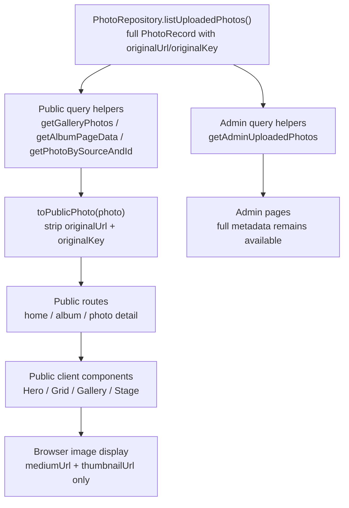
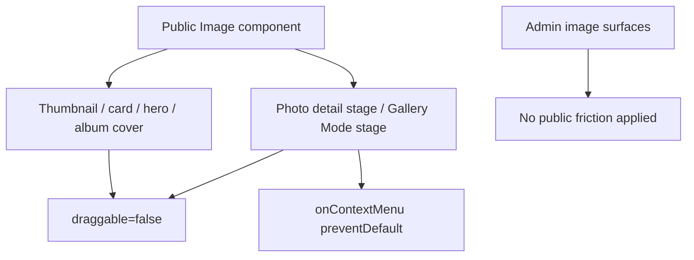

# Public Image Exposure Reduction Implementation Plan

> **For agentic workers:** REQUIRED SUB-SKILL: Use superpowers:subagent-driven-development (recommended) or superpowers:executing-plans to implement this plan task-by-task. Steps use checkbox (`- [ ]`) syntax for tracking.

**Goal:** Implement Phase 1 public image exposure reduction by keeping original photo URLs and keys out of public data flows while adding low-intrusion drag and context-menu friction to public image surfaces.

**Architecture:** Keep the existing repository as the full admin data source, then introduce a public DTO boundary in `src/lib/photos/public-photo.ts`. Public query helpers return `PublicPhoto` values, public components accept only public DTOs, and admin query paths continue using complete `PhotoRecord` values. Frontend friction is added only to public image components: all public images disable dragging where practical, and large detail/gallery stages prevent the native image context menu.

**Tech Stack:** Next.js 16 App Router, React 19, TypeScript, `next/image`, Node test runner with `tsx`, existing Prisma/JSON repository abstraction.

---

## Impact Scope

### Product Impact

- Public visitors still see the same home, album, gallery, and photo detail experiences.
- Public visitors should no longer receive `originalUrl` or `originalKey` through public query results or client component props.
- Public images become harder to casually drag-save.
- Photo detail and Gallery Mode large images no longer show the native browser image context menu.
- Admin pages are intentionally unaffected and keep access to original metadata.

### Security Impact

- Reduces application-level original asset leakage.
- Does not provide storage-level protection if R2 original URLs remain public or predictable.
- Does not prevent screenshots, devtools inspection, browser cache access, or network inspection.

### Data Impact

- No database schema changes.
- No R2 object moves.
- No migration of old objects.
- No signed URL or proxy download behavior.

### UX Impact

- Public image viewing and navigation should remain visually unchanged.
- Public large-image right-click behavior changes only on the image stage, not globally.
- Admin right-click, form, and image-management behavior should remain unchanged.

## Affected Modules

| Area | Files | Impact |
| --- | --- | --- |
| Public DTO boundary | `src/types/photo.ts`, `src/lib/photos/public-photo.ts`, `src/lib/photos/public-photo.test.ts` | Add public type and mapper that strips `originalUrl` / `originalKey`. |
| Public photo queries | `src/lib/photos/queries.ts`, `src/lib/photos/public-queries.test.ts` | Return `PublicPhoto[]` for public routes while preserving admin full-record access. |
| Home route and components | `src/app/(browse)/page.tsx`, `src/components/home/hero-section.tsx`, `src/components/home/photo-wall-section.tsx`, `src/components/gallery/photo-card.tsx`, `src/components/gallery/photo-grid.tsx`, `src/components/gallery/photo-stage.tsx` | Public props use `PublicPhoto`; images disable dragging. |
| Album route and gallery mode | `src/app/(browse)/albums/[slug]/page.tsx`, `src/components/gallery/album-photo-experience.tsx`, `src/components/gallery/album-gallery-mode.tsx`, `src/components/gallery/gallery-image-stage.tsx`, `src/components/gallery/gallery-film-strip.tsx` | Public props use `PublicPhoto`; gallery main image prevents context menu; thumbnails disable dragging. |
| Photo detail route | `src/app/photos/[source]/[id]/page.tsx`, `src/components/gallery/photo-stage.tsx` | Public detail uses `PublicPhoto`; main stage prevents context menu and disables dragging. |
| Album cover previews | `src/types/album.ts`, `src/lib/albums/album-slideshow.ts`, `src/components/albums/album-cover-slideshow.tsx` | Already uses display-only slideshow type; add drag prevention and keep original fields out. |
| Verification | `.session/verify.ps1`, `npm run build`, targeted `node --import tsx --test ...` commands | Confirm types, tests, build, and smoke verification. |

## New Feature Flow



## Public Image Friction Flow



## Minimum Implementation Steps

### Task 1: Confirm Next.js Local Docs For Server/Client Boundaries

**Files:**
- Read: `node_modules/next/dist/docs/01-app/01-getting-started/05-server-and-client-components.md`
- Read: `node_modules/next/dist/docs/01-app/01-getting-started/12-images.md`

- [ ] **Step 1: Read the relevant Next.js docs**

Run:

```powershell
Get-Content -Path node_modules/next/dist/docs/01-app/01-getting-started/05-server-and-client-components.md | Select-Object -First 220
Get-Content -Path node_modules/next/dist/docs/01-app/01-getting-started/12-images.md | Select-Object -First 220
```

Expected: output explains current App Router server/client component behavior and current `next/image` usage.

- [ ] **Step 2: Note implementation constraints**

Record these constraints in the implementation session notes:

```text
- Public Server Components must map full records to public DTOs before passing data into Client Components.
- Client Component props must stay serializable and must not include originalUrl/originalKey.
- next/image supports draggable={false} because it forwards valid img attributes.
```

### Task 2: Add Public Photo DTO And Mapper

**Files:**
- Modify: `src/types/photo.ts`
- Create: `src/lib/photos/public-photo.ts`
- Create: `src/lib/photos/public-photo.test.ts`

- [ ] **Step 1: Write the failing mapper test**

Create `src/lib/photos/public-photo.test.ts`:

```ts
import test from "node:test";
import assert from "node:assert/strict";

import { toPublicPhoto, toPublicPhotos } from "./public-photo";
import type { PhotoRecord } from "@/types/photo";

const fullPhoto: PhotoRecord = {
  id: 7,
  title: "Hidden Original",
  description: "Public description",
  location: "Taipei",
  shotAt: "2026-04-01T00:00:00.000Z",
  albumName: "Portfolio",
  albumSlug: "portfolio",
  exifData: { iso: 100 },
  createdAt: "2026-04-02T00:00:00.000Z",
  width: 3000,
  height: 2000,
  originalUrl: "https://cdn.example/photos/original.webp",
  mediumUrl: "https://cdn.example/photos/medium.webp",
  thumbnailUrl: "https://cdn.example/photos/thumb.webp",
  blurDataUrl: "data:image/webp;base64,abc",
  source: "uploaded",
  albumId: 11,
  originalKey: "private/original.webp",
  mediumKey: "public/medium.webp",
  thumbnailKey: "public/thumb.webp",
  storageProvider: "r2",
};

test("toPublicPhoto strips original URL and storage key", () => {
  const result = toPublicPhoto(fullPhoto);

  assert.equal("originalUrl" in result, false);
  assert.equal("originalKey" in result, false);
  assert.equal(result.mediumUrl, fullPhoto.mediumUrl);
  assert.equal(result.thumbnailUrl, fullPhoto.thumbnailUrl);
  assert.equal(result.title, fullPhoto.title);
  assert.equal(result.albumSlug, fullPhoto.albumSlug);
});

test("toPublicPhotos maps every record through the public boundary", () => {
  const result = toPublicPhotos([fullPhoto]);

  assert.equal(result.length, 1);
  assert.equal("originalUrl" in result[0], false);
  assert.equal("originalKey" in result[0], false);
  assert.equal(result[0].id, fullPhoto.id);
});
```

- [ ] **Step 2: Run the test to verify it fails**

Run:

```powershell
node --import tsx --test src/lib/photos/public-photo.test.ts
```

Expected: FAIL because `src/lib/photos/public-photo.ts` does not exist.

- [ ] **Step 3: Add the public type**

Modify `src/types/photo.ts` so it contains this exported type after `GalleryPhoto`:

```ts
export type PublicPhoto = Omit<GalleryPhoto, "originalUrl"> & {
  albumId?: number | null;
};
```

Keep `GalleryPhoto` and `PhotoRecord` unchanged so admin and repository code still have full metadata.

- [ ] **Step 4: Add the mapper**

Create `src/lib/photos/public-photo.ts`:

```ts
import type { PhotoRecord, PublicPhoto } from "@/types/photo";

export function toPublicPhoto(photo: PhotoRecord): PublicPhoto {
  return {
    id: photo.id,
    title: photo.title,
    description: photo.description,
    location: photo.location,
    shotAt: photo.shotAt,
    albumName: photo.albumName,
    albumSlug: photo.albumSlug,
    exifData: photo.exifData,
    createdAt: photo.createdAt,
    width: photo.width,
    height: photo.height,
    mediumUrl: photo.mediumUrl,
    thumbnailUrl: photo.thumbnailUrl,
    blurDataUrl: photo.blurDataUrl,
    source: photo.source,
    albumId: photo.albumId,
  };
}

export function toPublicPhotos(photos: PhotoRecord[]): PublicPhoto[] {
  return photos.map(toPublicPhoto);
}
```

- [ ] **Step 5: Run the mapper test to verify it passes**

Run:

```powershell
node --import tsx --test src/lib/photos/public-photo.test.ts
```

Expected: PASS.

- [ ] **Step 6: Commit**

Run:

```powershell
git add src/types/photo.ts src/lib/photos/public-photo.ts src/lib/photos/public-photo.test.ts
git commit -m "feat: add public photo DTO"
```

### Task 3: Convert Public Photo Query Helpers To Public DTOs

**Files:**
- Modify: `src/lib/photos/queries.ts`
- Create: `src/lib/photos/public-queries.test.ts`

- [ ] **Step 1: Write the public query boundary test**

Create `src/lib/photos/public-queries.test.ts`:

```ts
import test from "node:test";
import assert from "node:assert/strict";

import { toPublicPhoto } from "./public-photo";
import type { PhotoRecord } from "@/types/photo";

const record: PhotoRecord = {
  id: 1,
  title: "Query Boundary",
  createdAt: "2026-04-01T00:00:00.000Z",
  width: 1200,
  height: 800,
  originalUrl: "https://cdn.example/private/original.webp",
  mediumUrl: "https://cdn.example/public/medium.webp",
  thumbnailUrl: "https://cdn.example/public/thumb.webp",
  source: "uploaded",
  originalKey: "private/original.webp",
};

test("public photo DTO is safe to serialize for public routes", () => {
  const publicPhoto = toPublicPhoto(record);
  const serialized = JSON.stringify(publicPhoto);

  assert.equal(serialized.includes("originalUrl"), false);
  assert.equal(serialized.includes("originalKey"), false);
  assert.equal(serialized.includes("original.webp"), false);
  assert.equal(serialized.includes("medium.webp"), true);
  assert.equal(serialized.includes("thumb.webp"), true);
});
```

- [ ] **Step 2: Run the boundary test**

Run:

```powershell
node --import tsx --test src/lib/photos/public-queries.test.ts
```

Expected: PASS once Task 2 exists.

- [ ] **Step 3: Update imports in `src/lib/photos/queries.ts`**

Change the imports to include the public mapper and type:

```ts
import { toPublicPhoto, toPublicPhotos } from "@/lib/photos/public-photo";
import type { GalleryPhoto, PhotoRecord, PublicPhoto } from "@/types/photo";
```

- [ ] **Step 4: Keep source listing private to the module**

Keep `listPhotosForSource` returning complete records internally:

```ts
async function listPhotosForSource(source: string): Promise<PhotoRecord[]> {
  const photoRepository = getPhotoRepository();

  if (source === "uploaded") {
    return photoRepository.listUploadedPhotos();
  }

  if (source === "sample") {
    return [...samplePhotos].sort(byCreatedAtDesc);
  }

  return [];
}
```

- [ ] **Step 5: Change public query helpers to return `PublicPhoto`**

Update these functions in `src/lib/photos/queries.ts`:

```ts
export async function getPhotosForSource(source: string): Promise<PublicPhoto[]> {
  return toPublicPhotos(await listPhotosForSource(source));
}

export async function getGalleryPhotos(): Promise<PublicPhoto[]> {
  const uploadedPhotos = await getPhotoRepository().listUploadedPhotos();
  if (uploadedPhotos.length > 0) {
    return toPublicPhotos(uploadedPhotos);
  }

  return toPublicPhotos(samplePhotos);
}

export async function getRecentUploads(limit = 6): Promise<PublicPhoto[]> {
  const uploadedPhotos = await getPhotoRepository().listUploadedPhotos();
  return toPublicPhotos(uploadedPhotos.slice(0, limit));
}

export async function getPhotoBySourceAndId(source: string, id: number): Promise<PublicPhoto | null> {
  const photos = await listPhotosForSource(source);
  const photo = photos.find((item) => item.id === id);
  return photo ? toPublicPhoto(photo) : null;
}

export async function getPhotoNeighbors(source: string, id: number): Promise<{
  previous: PublicPhoto | null;
  next: PublicPhoto | null;
}> {
  const photos = await listPhotosForSource(source);
  const index = photos.findIndex((photo) => photo.id === id);

  if (index === -1) {
    return {
      previous: null,
      next: null,
    };
  }

  return {
    previous: photos[index - 1] ? toPublicPhoto(photos[index - 1]) : null,
    next: photos[index + 1] ? toPublicPhoto(photos[index + 1]) : null,
  };
}

export async function getPhotosByAlbumSlug(slug: string): Promise<PublicPhoto[]> {
  const normalizedSlug = normalizeAlbumSlug(slug);
  const [albums, photos] = await Promise.all([
    getAlbums(),
    getPhotoRepository().listUploadedPhotos(),
  ]);
  const album = albums.find(
    (item) => normalizeAlbumSlug(item.slug) === normalizedSlug,
  );

  if (!album) {
    return [];
  }

  return toPublicPhotos(photos.filter((photo) => photo.albumId === album.id));
}

export async function getAlbumPageData(slug: string): Promise<{
  album: Awaited<ReturnType<typeof getAlbums>>[number];
  photos: PublicPhoto[];
} | null> {
  const normalizedSlug = normalizeAlbumSlug(slug);
  const [albums, photos] = await Promise.all([
    getAlbums(),
    getPhotoRepository().listUploadedPhotos(),
  ]);
  const album = albums.find(
    (item) => normalizeAlbumSlug(item.slug) === normalizedSlug,
  );

  if (!album) {
    return null;
  }

  return {
    album,
    photos: toPublicPhotos(photos.filter((photo) => photo.albumId === album.id)),
  };
}
```

- [ ] **Step 6: Preserve admin full-record query**

Keep this function returning `PhotoRecord[]`:

```ts
export async function getAdminUploadedPhotos(): Promise<PhotoRecord[]> {
  const uploadedPhotos = await getPhotoRepository().listUploadedPhotos();
  return uploadedPhotos.sort(byCreatedAtDesc);
}
```

- [ ] **Step 7: Run focused tests**

Run:

```powershell
node --import tsx --test src/lib/photos/public-photo.test.ts src/lib/photos/public-queries.test.ts src/lib/albums/album-slideshow.test.ts
```

Expected: PASS.

- [ ] **Step 8: Commit**

Run:

```powershell
git add src/lib/photos/queries.ts src/lib/photos/public-queries.test.ts
git commit -m "feat: return public photos from public queries"
```

### Task 4: Retype Public Components To Reject Full Photo Records

**Files:**
- Modify: `src/components/home/hero-section.tsx`
- Modify: `src/components/home/photo-wall-section.tsx`
- Modify: `src/components/gallery/photo-card.tsx`
- Modify: `src/components/gallery/photo-grid.tsx`
- Modify: `src/components/gallery/photo-stage.tsx`
- Modify: `src/components/gallery/album-photo-experience.tsx`
- Modify: `src/components/gallery/album-gallery-mode.tsx`
- Modify: `src/components/gallery/gallery-image-stage.tsx`
- Modify: `src/components/gallery/gallery-film-strip.tsx`

- [ ] **Step 1: Replace public component photo imports**

In each listed public component, replace:

```ts
import type { GalleryPhoto } from "@/types/photo";
```

with:

```ts
import type { PublicPhoto } from "@/types/photo";
```

- [ ] **Step 2: Retype public component props**

Use these prop shapes:

```ts
type HeroSectionProps = {
  photos: PublicPhoto[];
};

type PhotoWallSectionProps = {
  photos: PublicPhoto[];
};

type PhotoCardProps = {
  photo: PublicPhoto;
};

type PhotoStageProps = {
  photo: PublicPhoto;
  priority?: boolean;
  disableContextMenu?: boolean;
};

type AlbumPhotoExperienceProps = {
  albumName: string;
  albumSlug: string;
  photos: PublicPhoto[];
};

type AlbumGalleryModeProps = {
  albumName: string;
  albumSlug: string;
  photos: PublicPhoto[];
  initialPhotoId?: number | null;
  onBackToGrid: (photoId?: number | null) => void;
  onPhotoChange: (photoId: number) => void;
};

type GalleryImageStageProps = {
  photo: PublicPhoto;
  priority?: boolean;
};

type GalleryFilmStripProps = {
  photos: PublicPhoto[];
  currentIndex: number;
  onSelect: (index: number) => void;
};
```

- [ ] **Step 3: Run TypeScript build**

Run:

```powershell
npm run build
```

Expected: PASS. If TypeScript reports any remaining public component expecting `GalleryPhoto`, update that component to `PublicPhoto` unless it is an admin component.

- [ ] **Step 4: Check no public components reference original fields**

Run:

```powershell
rg -n "originalUrl|originalKey" "src/app/(browse)" "src/app/photos" "src/components/home" "src/components/gallery" "src/components/albums"
```

Expected: no matches in public routes/components.

- [ ] **Step 5: Commit**

Run:

```powershell
git add src/components/home src/components/gallery
git commit -m "feat: type public components with safe photo DTO"
```

### Task 5: Add Public Image Drag And Context Menu Friction

**Files:**
- Modify: `src/components/gallery/photo-stage.tsx`
- Modify: `src/app/photos/[source]/[id]/page.tsx`
- Modify: `src/components/gallery/gallery-image-stage.tsx`
- Modify: `src/components/gallery/gallery-film-strip.tsx`
- Modify: `src/components/home/hero-section.tsx`
- Modify: `src/components/albums/album-cover-slideshow.tsx`

- [ ] **Step 1: Add optional detail-stage context menu prevention**

In `src/components/gallery/photo-stage.tsx`, update the props:

```tsx
type PhotoStageProps = {
  photo: PublicPhoto;
  priority?: boolean;
  disableContextMenu?: boolean;
};
```

Update the component signature:

```tsx
export function PhotoStage({
  photo,
  priority = false,
  disableContextMenu = false,
}: PhotoStageProps) {
```

Update the wrapper `div`:

```tsx
<div
  className="relative w-full overflow-hidden rounded-[1.25rem]"
  style={{ aspectRatio: `${photo.width} / ${photo.height}` }}
  onContextMenu={disableContextMenu ? (event) => event.preventDefault() : undefined}
>
```

Add `draggable={false}` to the `Image`:

```tsx
<Image
  src={photo.mediumUrl}
  alt={photo.title}
  fill
  priority={priority}
  draggable={false}
  className="object-cover"
  sizes="(max-width: 640px) 100vw, (max-width: 1280px) 70vw, 1200px"
  placeholder={photo.blurDataUrl ? "blur" : "empty"}
  blurDataURL={photo.blurDataUrl}
/>
```

- [ ] **Step 2: Enable context menu prevention only on the detail page**

In `src/app/photos/[source]/[id]/page.tsx`, update the detail stage call:

```tsx
<PhotoStage photo={photo} priority disableContextMenu />
```

- [ ] **Step 3: Add gallery-stage context menu prevention**

In `src/components/gallery/gallery-image-stage.tsx`, update the wrapper `div`:

```tsx
<div
  className="relative h-full w-full"
  onContextMenu={(event) => event.preventDefault()}
>
```

Add `draggable={false}` to the `Image`:

```tsx
<Image
  src={photo.mediumUrl}
  alt={photo.title}
  fill
  priority={priority}
  draggable={false}
  className="object-contain"
  sizes="100vw"
  placeholder={photo.blurDataUrl ? "blur" : "empty"}
  blurDataURL={photo.blurDataUrl}
/>
```

- [ ] **Step 4: Disable dragging on gallery thumbnails**

In `src/components/gallery/gallery-film-strip.tsx`, add `draggable={false}` to the thumbnail `Image`:

```tsx
<Image
  src={photo.thumbnailUrl}
  alt=""
  fill
  sizes="72px"
  draggable={false}
  className="object-cover"
  placeholder={photo.blurDataUrl ? "blur" : "empty"}
  blurDataURL={photo.blurDataUrl}
/>
```

- [ ] **Step 5: Disable dragging on hero background images**

In `src/components/home/hero-section.tsx`, add `draggable={false}` to `PhotoBackground`'s `Image`:

```tsx
<Image
  src={photo.mediumUrl}
  alt={photo.title}
  fill
  priority={priority}
  draggable={false}
  className="object-cover"
  sizes="100vw"
  placeholder={photo.blurDataUrl ? "blur" : "empty"}
  blurDataURL={photo.blurDataUrl ?? undefined}
/>
```

- [ ] **Step 6: Disable dragging on album cover images**

In `src/components/albums/album-cover-slideshow.tsx`, add `draggable={false}`:

```tsx
<Image
  key={photo.id}
  src={photo.mediumUrl}
  alt={photo.title}
  fill
  sizes="(max-width: 640px) 100vw, (max-width: 1280px) 50vw, 33vw"
  draggable={false}
  className="object-cover transition-opacity duration-700"
  style={{ opacity: isVisible ? 1 : 0 }}
  placeholder={photo.blurDataUrl ? "blur" : "empty"}
  blurDataURL={photo.blurDataUrl ?? undefined}
/>
```

- [ ] **Step 7: Run build**

Run:

```powershell
npm run build
```

Expected: PASS.

- [ ] **Step 8: Commit**

Run:

```powershell
git add -- 'src/app/photos/[source]/[id]/page.tsx' src/components/gallery/photo-stage.tsx src/components/gallery/gallery-image-stage.tsx src/components/gallery/gallery-film-strip.tsx src/components/home/hero-section.tsx src/components/albums/album-cover-slideshow.tsx
git commit -m "feat: reduce casual public image saving"
```

### Task 6: Add Residual Risk Documentation To User-Facing Backlog

**Files:**
- Modify: `docs/issue-tracker/user-feedback-backlog.md`

- [ ] **Step 1: Update Feedback 7 current status**

In `docs/issue-tracker/user-feedback-backlog.md`, under `Feedback 7: Reduce direct photo download exposure`, append this note to the current status or suggested follow-up section:

```md
- Phase 1 should be treated as application-level exposure reduction only: public pages should not send `originalUrl` or `originalKey` to the browser, but public or predictable R2 original object URLs remain a residual storage risk until a Phase 2 R2 privatization or signed/proxied access phase.
```

- [ ] **Step 2: Commit**

Run:

```powershell
git add docs/issue-tracker/user-feedback-backlog.md
git commit -m "docs: note image protection residual storage risk"
```

### Task 7: Final Verification

**Files:**
- Verify all changed files.

- [ ] **Step 1: Run focused unit tests**

Run:

```powershell
node --import tsx --test src/lib/photos/public-photo.test.ts src/lib/photos/public-queries.test.ts src/lib/albums/album-slideshow.test.ts src/lib/gallery/album-gallery-url.test.ts src/lib/gallery/gallery-playback.test.ts
```

Expected: PASS.

- [ ] **Step 2: Search for public original exposure**

Run:

```powershell
rg -n "originalUrl|originalKey" "src/app/(browse)" "src/app/photos" "src/components/home" "src/components/gallery" "src/components/albums" "src/lib/photos/queries.ts"
```

Expected: no public exposure matches. If a match appears in an admin-only path, move the search scope or document why it is admin-only.

- [ ] **Step 3: Run production build**

Run:

```powershell
npm run build
```

Expected: PASS.

- [ ] **Step 4: Run repository verification**

Run:

```powershell
.\.session\verify.ps1
```

Expected: PASS.

- [ ] **Step 5: Manual browser verification**

Start the app when no dev server is already running:

```powershell
npm run dev
```

Verify:

```text
- Home page images render.
- Album page grid renders.
- Gallery Mode opens and controls still work.
- Photo detail page renders.
- Right-click on photo detail main image does not open the native image context menu.
- Right-click on Gallery Mode main image does not open the native image context menu.
- Admin photo management still renders and can use normal browser interactions.
```

- [ ] **Step 6: Commit verification fixes**

If verification forced small fixes, stage only the files changed for those fixes and commit them. For example, when the build fix touched the public mapper and photo stage:

```powershell
git add src/lib/photos/public-photo.ts src/components/gallery/photo-stage.tsx
git commit -m "fix: complete public image exposure reduction"
```

## Plan Self-Review

- Spec coverage: DTO boundary is covered in Tasks 2-4; public image friction is covered in Task 5; residual R2 risk documentation is covered in Task 6; verification is covered in Task 7.
- Scope check: the plan does not include watermarking, R2 privatization, object migration, signed URLs, or admin original download routes.
- Type consistency: `PublicPhoto` is defined once in `src/types/photo.ts`, mapping lives in `src/lib/photos/public-photo.ts`, and public components use `PublicPhoto`.
- Risk note: `PhotoStage` is reused by `PhotoCard`, so the plan uses `disableContextMenu?: boolean` and enables it only on the photo detail page. Gallery Mode has its own stage component and handles context-menu prevention there.
