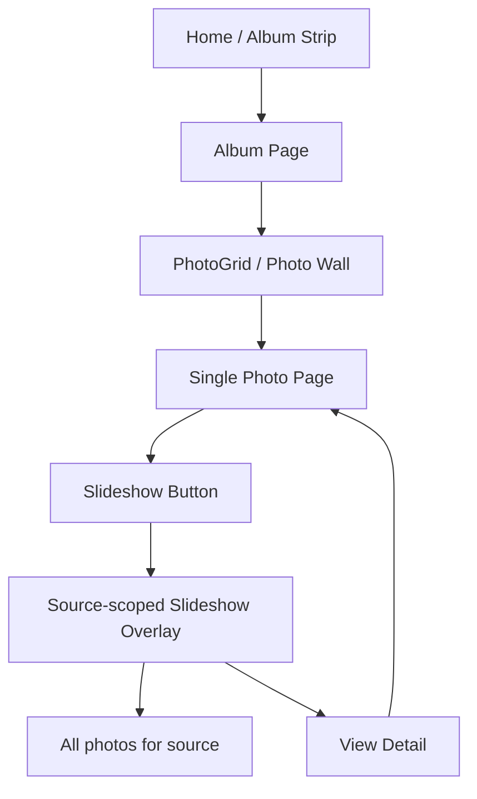
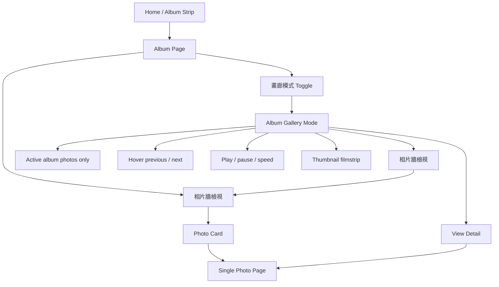
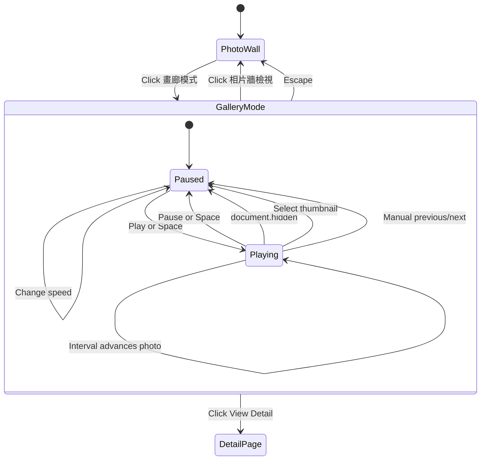
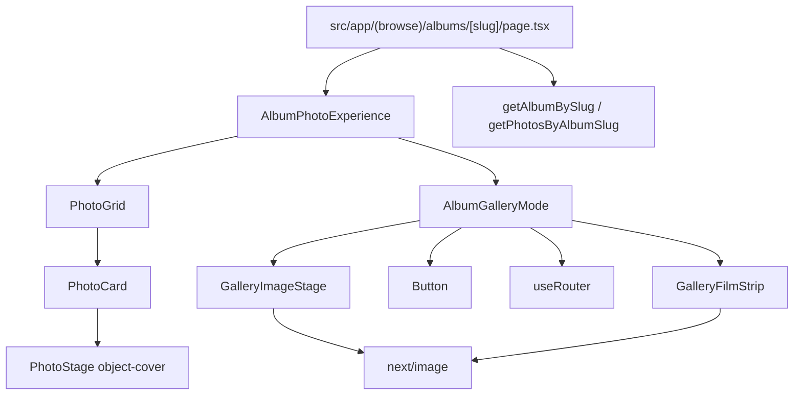

# Album Gallery Mode Phase 1 Design

## Goal

Move slideshow behavior out of the single-photo page and into album pages as an album-scoped viewing mode. Album pages will support two views:

- `相片牆檢視`: the current masonry-style photo wall.
- `畫廊模式`: a focused, full-screen album gallery for viewing one album at a time.

## Product Decisions

- Gallery scope is the active album only.
- The single-photo page no longer owns slideshow entry.
- Gallery Mode does not show photo title or date. Users can open `View Detail` for metadata, comments, likes, and EXIF.
- Previous and next controls appear on desktop hover.
- Gallery images must be fully visible, so portrait and landscape photos use uncropped `object-contain` rendering.
- Playback cadence is user-selectable: 3, 5, 8, or 12 seconds.
- Playback pauses when the tab is hidden, when the user manually selects a thumbnail, and when the user manually goes previous/next.

## Feature Workflow

### Current Workflow



Problem: slideshow is launched from a single photo and uses all photos in the same `source`, not the active album.

### Phase 1 Workflow



## Gallery State Workflow



## Data Flow

```mermaid
flowchart LR
  Slug[params.slug] --> AlbumPage[albums/[slug]/page.tsx]
  AlbumPage --> GetAlbum[getAlbumBySlug]
  AlbumPage --> GetPhotos[getPhotosByAlbumSlug]
  GetAlbum --> AlbumData[AlbumSummary]
  GetPhotos --> AlbumPhotos[GalleryPhoto[]]
  AlbumData --> AlbumHeader[Album header]
  AlbumPhotos --> AlbumExperience[AlbumPhotoExperience]
  AlbumExperience --> PhotoGrid[PhotoGrid]
  AlbumExperience --> GalleryMode[AlbumGalleryMode]
  GalleryMode --> MainImage[GalleryImageStage uses mediumUrl]
  GalleryMode --> Thumbnails[GalleryFilmStrip uses thumbnailUrl]
  GalleryMode --> DetailRoute[router.push photo detail]
```

The album route remains a Server Component. Interactive state starts at `AlbumPhotoExperience`, which is the client boundary. No gallery component should fetch its own data in Phase 1.

### Removed Data Flow

```mermaid
flowchart TD
  DetailPage[photos/[source]/[id]/page.tsx] --> GetPhotosForSource[getPhotosForSource]
  GetPhotosForSource --> AllSourcePhotos[All photos for source]
  AllSourcePhotos --> SlideshowViewer[SlideshowViewer]
```

This detail-page slideshow path is removed. Detail pages keep previous/next detail navigation, likes, comments, and EXIF.

## Module Architecture



## Component Responsibilities

- `AlbumPhotoExperience`: owns `wall` versus `gallery` mode.
- `AlbumGalleryMode`: owns current index, playback state, playback delay, keyboard controls, hover controls, and detail navigation.
- `GalleryImageStage`: renders the active image with `object-contain` so the image is never cropped.
- `GalleryFilmStrip`: renders thumbnail navigation from `thumbnailUrl`.
- `PhotoGrid`, `PhotoCard`, and `PhotoStage`: remain responsible for the Photo Wall and keep their current `object-cover` behavior.

## Phase 1 Acceptance Criteria

- Album pages default to `相片牆檢視`.
- Album pages can switch to `畫廊模式`.
- Gallery Mode only contains photos from the active album.
- Single-photo pages no longer show a slideshow entry.
- Gallery Mode does not show photo title/date.
- `View Detail` opens the current photo detail page.
- Portrait and landscape photos are fully visible in Gallery Mode.
- Desktop previous/next buttons appear on hover.
- Keyboard previous/next, Escape, and Space work.
- Playback interval can be changed between 3, 5, 8, and 12 seconds.
- Thumbnail navigation uses `thumbnailUrl`.

## Deferred

- URL query state, such as `?view=gallery&photo=123`.
- Touch swipe gestures.
- Full modal focus trap.
- Virtualized thumbnails for very large albums.
- Playback progress bar.
- Play-once versus loop setting.
