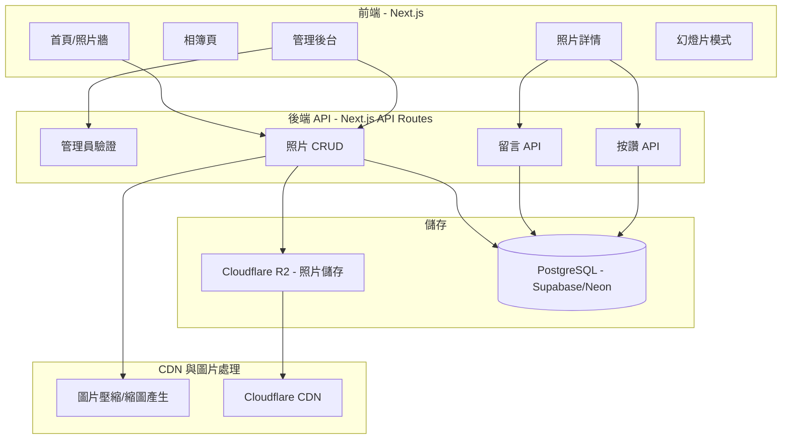
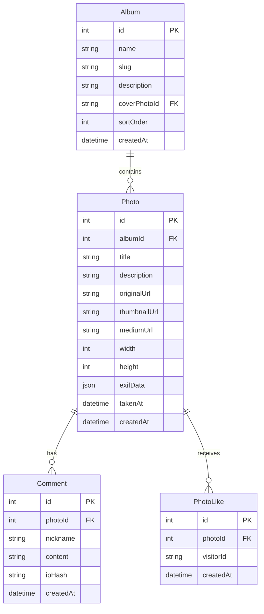

# 個人照片展示網站 - 完整規劃

## 整體架構

採用**前後端分離**架構，優先使用免費/低成本方案，並具備可擴展性。

## 技術選型推薦

| 項目 | 推薦方案 | 理由 |

|------|---------|------|

| 框架 | Next.js 14 (App Router) | SSR/SSG 支援好、SEO 友善、全端整合 |

| 部署 | Vercel (免費方案) | 與 Next.js 最佳整合、自動 CI/CD |

| 照片儲存 | Cloudflare R2 | 免費出站流量、10GB 免費、S3 相容 |

| 資料庫 | Neon PostgreSQL (免費方案) | Serverless、免費額度夠用 |

| ORM | Prisma | 型別安全、遷移方便 |

| 圖片處理 | Sharp | 壓縮、產生縮圖、讀取 EXIF |

| UI 框架 | Tailwind CSS + shadcn/ui | 美觀、元件豐富、客製化方便 |

| 管理員驗證 | NextAuth.js (Credentials) | 只需要單一管理員，簡單即可 |

## 資料庫設計

## 分階段實作計劃

### Phase 1：最小可用版本 (MVP)

核心功能：管理員上傳照片、訪客瀏覽照片。

- 專案初始化：Next.js + Tailwind + Prisma + Cloudflare R2
- 管理員登入頁面（帳號密碼驗證）
- 照片上傳功能（支援多張批次上傳、拖拉上傳）
- 上傳時自動產生三種尺寸：原圖、中圖（1200px）、縮圖（400px）
- 首頁照片牆（瀑布流佈局）
- 照片點擊放大檢視
- RWD 響應式設計（手機/平板/桌面）

### Phase 2：核心體驗提升

- 相簿分類功能（CRUD、拖拉排序）
- EXIF 資訊讀取與顯示（相機型號、焦距、光圈、快門、ISO）
- 幻燈片瀏覽模式（鍵盤左右切換、全螢幕）
- 照片懶載入（Intersection Observer）

### Phase 3：社交互動

- 訪客留言功能（需填暱稱，無需註冊）
- 按讚/喜歡功能（基於 localStorage + IP 防重複）
- 留言管理後台（管理員可刪除不當留言）

---

## 你可能忽略的思考盲點

### 1. 圖片尺寸與效能

上傳原圖通常是 5-20MB，直接顯示會很慢。**必須**在上傳時產生多種尺寸：

- 縮圖（列表頁用，~400px 寬）
- 中圖（詳情頁用，~1200px 寬）
- 原圖保留但不直接顯示

同時建議使用 WebP/AVIF 格式來進一步壓縮。

### 2. 圖片格式與瀏覽器相容

現代瀏覽器支援 WebP/AVIF，但需要做降級處理。Next.js 的 `next/image` 可以自動處理，但自行儲存時要注意產生多格式。

### 3. 防盜連與流量保護

照片直接放 public URL，可能被他人嵌入使用，消耗你的流量。建議：

- Cloudflare R2 設定 Referer 白名單
- 考慮對中圖加上半透明浮水印

### 4. SEO 與社群分享

照片網站很需要 SEO 和 Open Graph 標籤：

- 每張照片頁面要有獨立 URL 和 meta 標籤
- 分享到社群時要能顯示預覽圖
- 建議加上 sitemap.xml

### 5. 備份策略

Cloudflare R2 雖然可靠，但建議：

- 本地保留原始照片備份
- 資料庫定期匯出備份

### 6. 隱私與法律

- 照片中若有路人的臉，可能涉及肖像權
- EXIF 資訊可能包含 GPS 座標，顯示前應考慮是否要移除位置資訊
- 留言功能需要考慮垃圾留言防護（簡易驗證碼或 reCAPTCHA）

### 7. 載入速度優化

- 使用 CDN 加速（Cloudflare 本身就有）
- 圖片懶載入（首屏只載入可見區域）
- 使用 blur placeholder（先顯示模糊預覽再載入清晰圖）
- 考慮使用 blurhash 技術

### 8. 管理員體驗

上傳大量照片時：

- 需要上傳進度條
- 需要批次操作（批次刪除、批次移動相簿）
- 照片排序功能（拖拉排序）

---

## 預估成本（免費方案可覆蓋的範圍）

| 服務 | 免費額度 | 超出後費用 |

|------|---------|-----------|

| Vercel | 100GB 頻寬/月 | $20/月起 |

| Cloudflare R2 | 10GB 儲存、免出站流量 | $0.015/GB/月 |

| Neon PostgreSQL | 0.5GB 儲存 | $19/月起 |

以一般個人攝影網站的流量來說，**初期幾乎可以完全免費運行**。